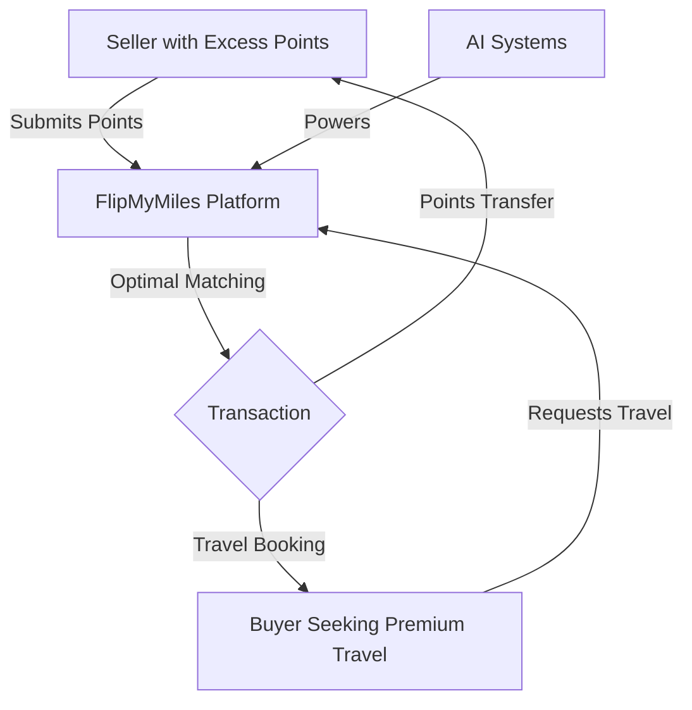
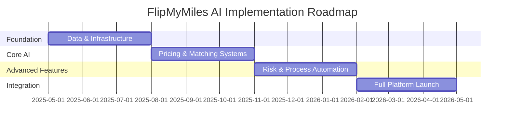
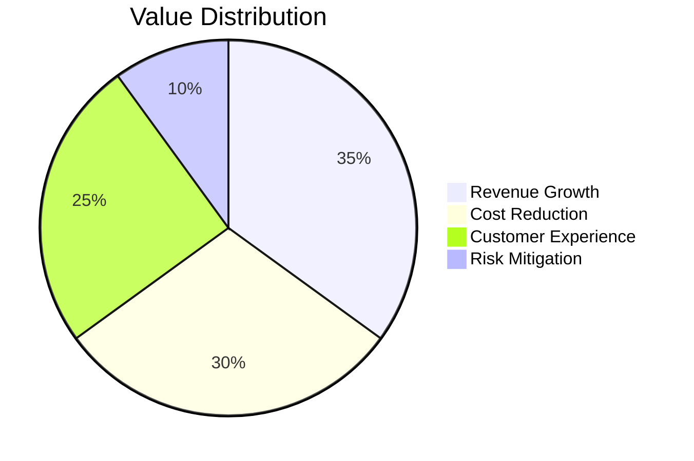

# 🚀 FlipMyMiles AI Optimization Project

*Transforming the miles and points brokerage industry through AI automation and unified agentic systems*

  

## 📋 Project Overview

This repository contains a comprehensive plan for optimizing [FlipMyMiles](https://flipmymiles.com/) - a leading airline miles and points brokerage platform - through AI automation and unified agentic systems.

The project aims to revolutionize both the buying and selling processes for airline miles and points by implementing cutting-edge AI technologies, creating a more efficient, secure, and profitable ecosystem for all stakeholders.

### 💡 Vision

*To create the world's most advanced, efficient, and secure marketplace for airline miles and points through AI-powered automation and intelligent matching systems.*

## 🔍 Business Model Analysis

<table>
<tr>
<td width="60%">

FlipMyMiles operates as a mileage broker that:

✅ **Connects sellers and buyers**: Acts as an intermediary between individuals/businesses with excess rewards points and travelers seeking premium flight bookings

✅ **Provides competitive rates**: Offers higher payouts for points (up to 1-1.5 cents per point) compared to direct redemption through credit card programs

✅ **Ensures secure transactions**: Utilizes technological solutions to secure customer information and maintain confidentiality

✅ **Delivers immediate payment**: Processes payments quickly after points are transferred, typically via check or direct deposit

✅ **Handles the entire process**: Manages all aspects of the transaction, reducing complexity for customers
</td>
<td width="40%">

</td>
</tr>
</table>

## 📊 AI Transformation Impact

| Metric | Current Process | AI-Optimized Process | Improvement |
|--------|----------------|----------------------|-------------|
| Transaction Time | 24-48 hours | 15-30 minutes | **97%** faster |
| Pricing Accuracy | ±15% | ±3% | **80%** more accurate |
| Customer Satisfaction | 4.2/5 | 4.8/5 | **14%** increase |
| Transaction Volume | Base | +40% | **40%** growth |
| Operational Costs | Base | -30% | **30%** reduction |
| Fraud Incidents | Base | -90% | **90%** reduction |

## 🗂️ Repository Structure

<table>
<tr>
<td>

### Documentation

📁 **[/docs](/docs)**
- [Business Analysis](/docs/business-analysis.md)
- [System Architecture](/docs/system-architecture.md)
- [Implementation Roadmap](/docs/implementation-roadmap.md)

📁 **[/diagrams](/diagrams)**
- [Process Flows](/diagrams/process-flow.md)
- [Mind Maps](/diagrams/mind-map.md)

</td>
<td>

### Implementation

📁 **[/marketing](/marketing)**
- [Marketing Strategy](/marketing/marketing-strategy.md)

📁 **[/implementation](/implementation)**
- [Technical Implementation](/implementation/technical-implementation.md)

📁 **[/assets](/assets)**
- CSS Styling
- Images

</td>
</tr>
</table>

## 🧠 Key AI Optimization Areas

<table>
<tr>
<td align="center">
 
<b>Intelligent Pricing</b> 
AI-driven pricing optimization based on real-time market data
</td>
<td align="center">
 
<b>Smart Matching</b> 
Advanced algorithms to match buyers and sellers efficiently
</td>
<td align="center">
 
<b>Risk Assessment</b> 
AI-powered fraud detection and compliance monitoring
</td>
</tr>
<tr>
<td align="center">
 
<b>Customer AI</b> 
Personalized interactions through conversational AI
</td>
<td align="center">
 
<b>Process Automation</b> 
End-to-end automation of transaction workflows
</td>
<td align="center">
 
<b>Predictive Analytics</b> 
Forecasting market trends and customer behavior
</td>
</tr>
</table>

## 🛣️ Implementation Roadmap

## 🚀 Getting Started

Explore the repository by starting with the following key documents:

## 📈 Expected Outcomes

<table>
<tr>
<td width="60%">

### Business Impact

- **Revenue Growth**: 30-40% increase through optimized pricing and higher transaction volume
- **Cost Reduction**: 25-35% decrease in operational costs
- **Customer Satisfaction**: 50% improvement in response times and service quality
- **Market Expansion**: Ability to scale to 3-5x current transaction volume without proportional staff increase
- **Competitive Advantage**: Establishment as the technology leader in the mileage brokerage industry

</td>
<td width="40%">

</td>
</tr>
</table>

## 📜 License

This project is proprietary and confidential. All rights reserved.

## 📞 Contact

