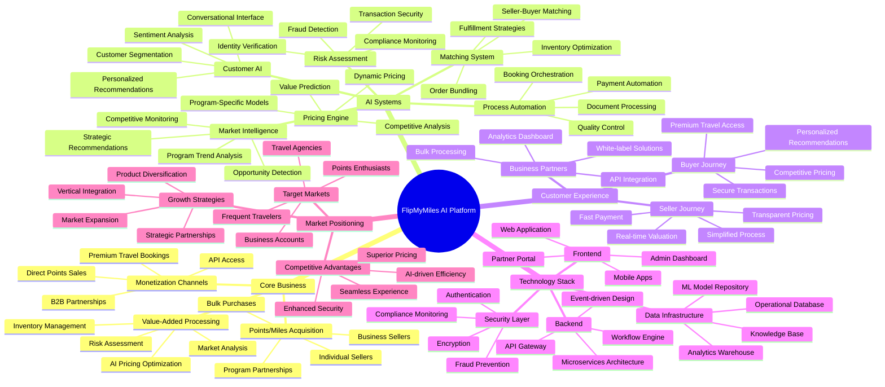
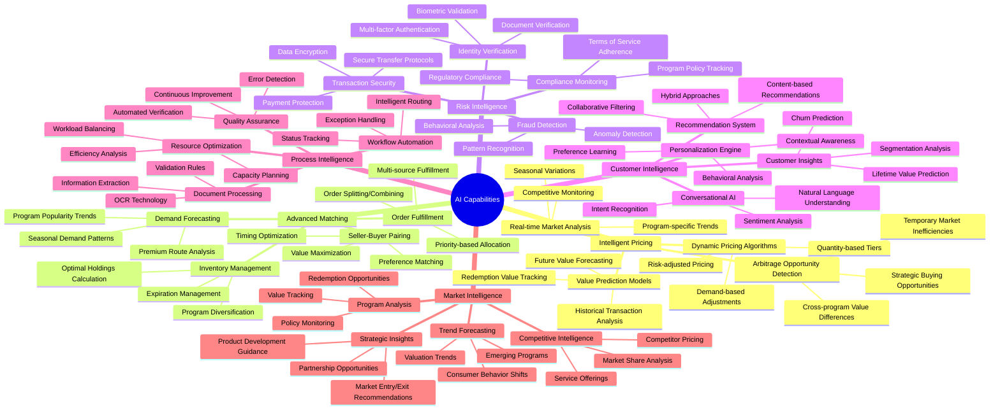
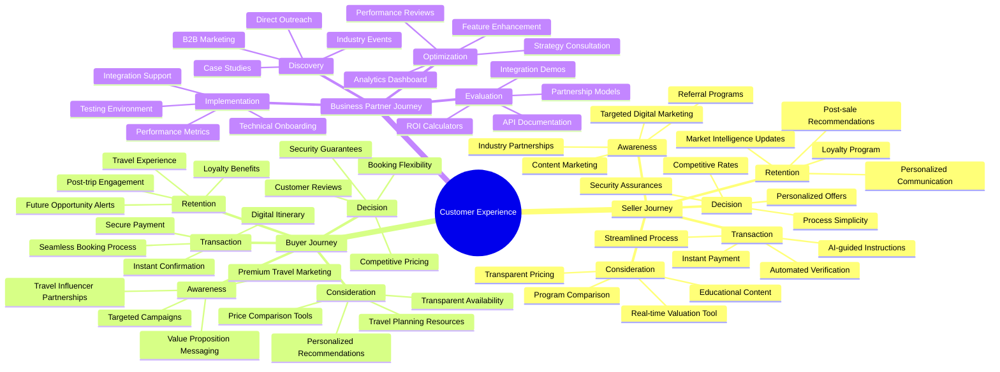
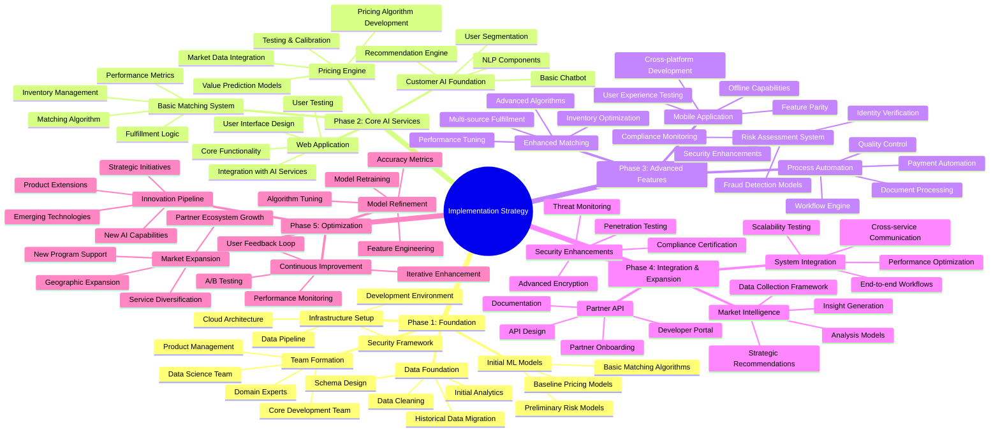
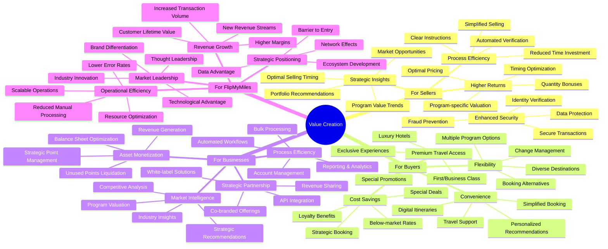
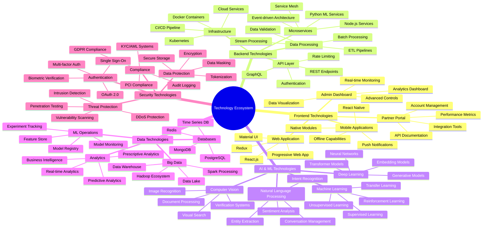

# FlipMyMiles AI Optimization Mind Map

## Overview

This mind map visualizes the key concepts, relationships, and components of the AI-optimized FlipMyMiles platform. It provides a holistic view of how AI automation and unified agentic systems transform the miles and points brokerage business.

## Core Business Model Mind Map

## AI Capabilities Detailed Mind Map

## Customer Journey Mind Map

## Implementation Strategy Mind Map

## Value Creation Mind Map

## Technology Ecosystem Mind Map

## Conclusion

This comprehensive mind map visualizes the interconnected components of the AI-optimized FlipMyMiles platform. It illustrates how AI technologies transform every aspect of the business, from core operations to customer experience, creating a sophisticated ecosystem that delivers superior value to all stakeholders.

The mind map serves as both a strategic overview and a detailed reference for implementation planning, highlighting the relationships between different components and the holistic nature of the AI transformation strategy.
