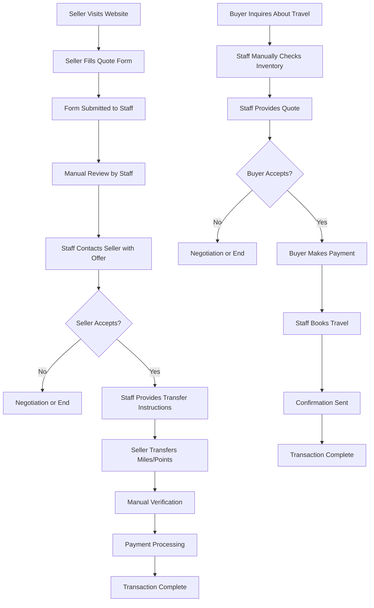
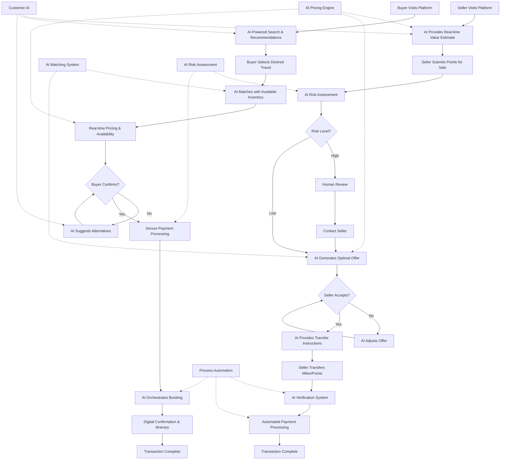
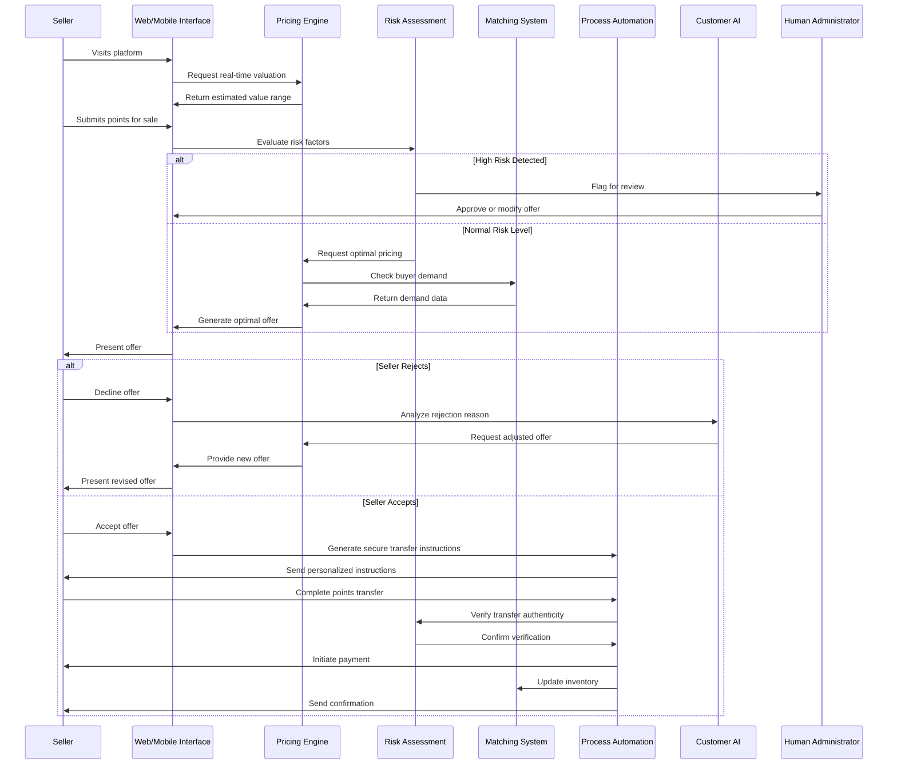
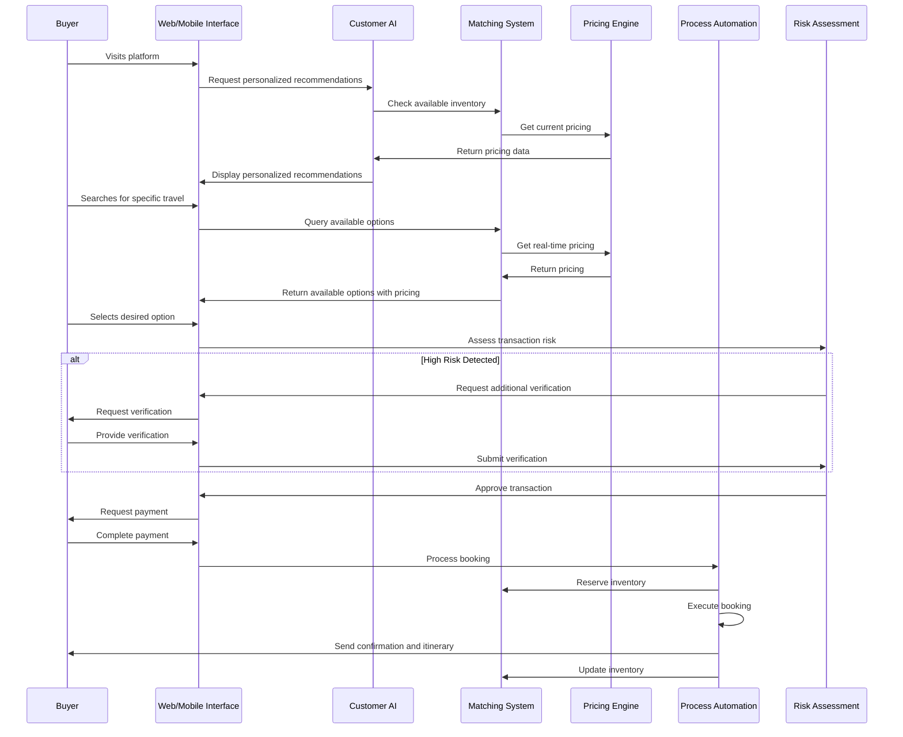
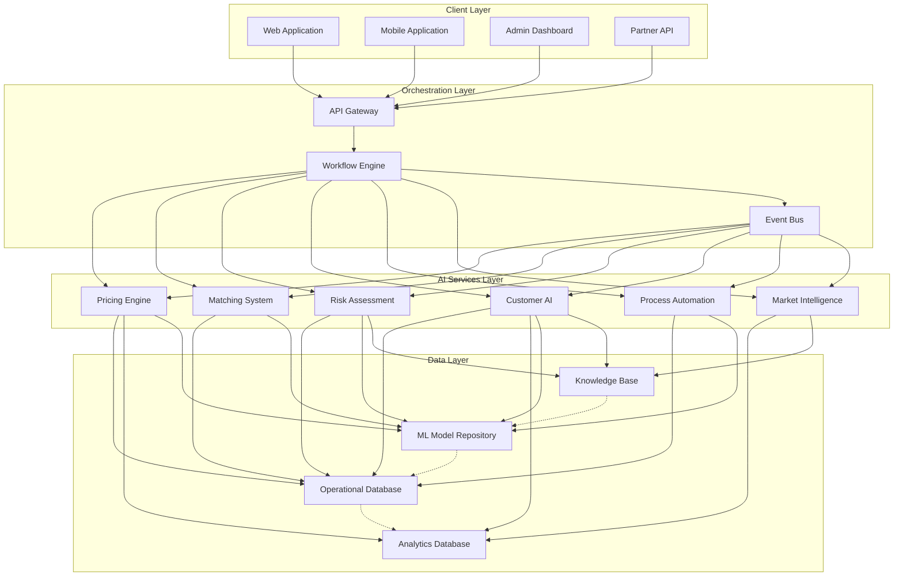
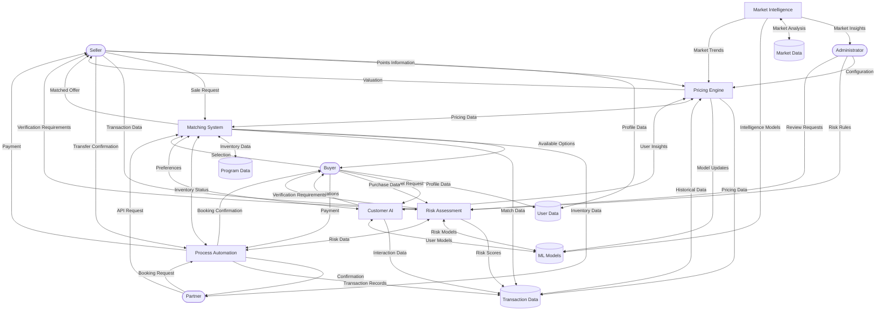
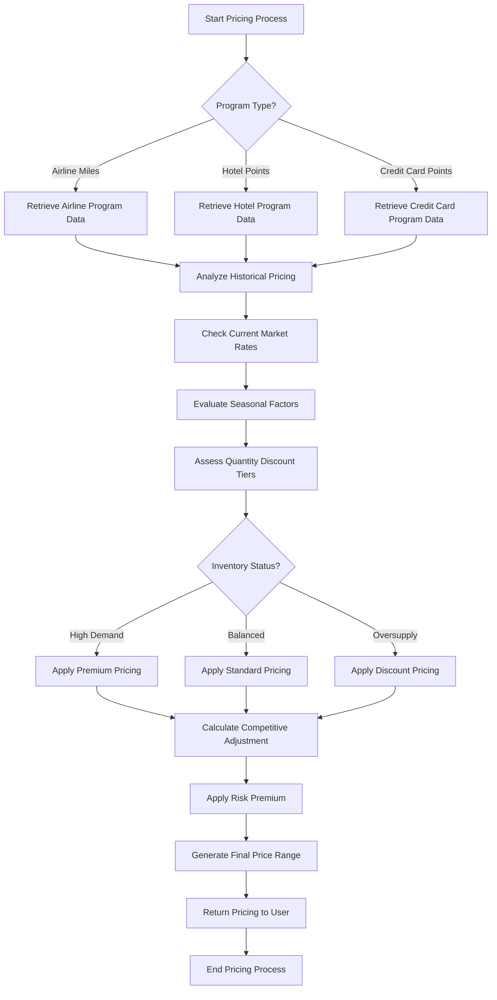
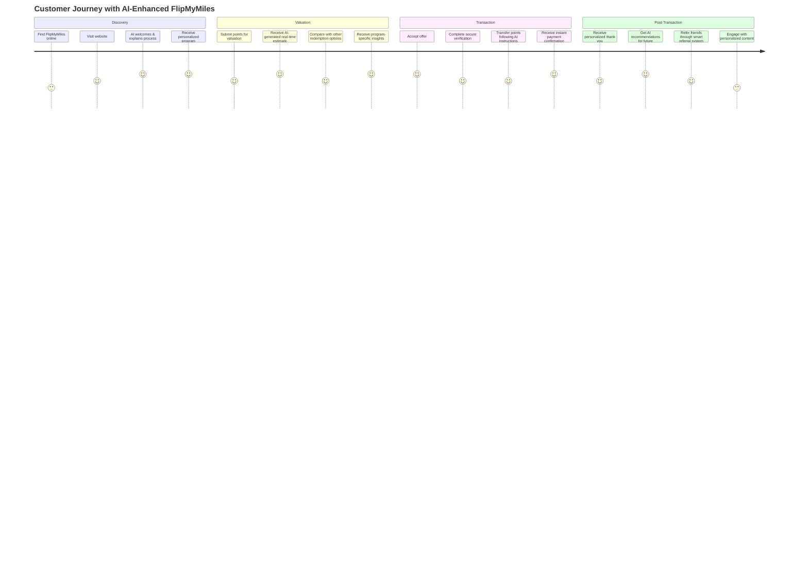

# FlipMyMiles AI-Optimized Process Flows

## Overview

This document visualizes the key process flows for the AI-enhanced FlipMyMiles platform, highlighting how AI automation and unified agentic systems optimize both the buying and selling experiences.

## Current vs. AI-Optimized Process Comparison

### Current Manual Process Flow

### AI-Optimized Process Flow

## Detailed AI-Optimized Selling Process

## Detailed AI-Optimized Buying Process

## AI System Integration Architecture

## Data Flow Diagram

## AI Decision Flow for Optimal Pricing

## AI-Powered Customer Journey Map

## Conclusion

The AI-optimized process flows demonstrate significant improvements in efficiency, accuracy, and customer experience compared to the traditional manual approach. Key benefits include:

1. **Reduced Processing Time**: From days to minutes for most transactions
2. **Enhanced Accuracy**: Data-driven pricing and matching decisions
3. **Improved Security**: Automated risk assessment and verification
4. **Better Customer Experience**: Personalized, responsive interactions
5. **Increased Scalability**: Ability to handle significantly higher transaction volumes
6. **Market Responsiveness**: Real-time adaptation to market conditions

These optimized processes form the foundation of the FlipMyMiles AI transformation, enabling the company to deliver superior value to customers while achieving operational excellence.
