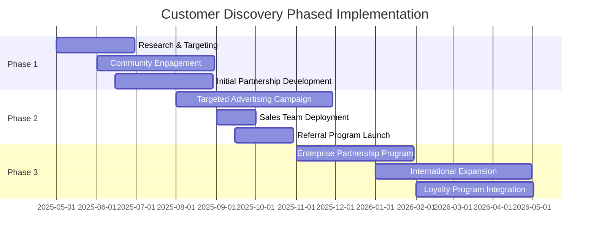

# FlipMyMiles Customer Discovery Strategy

  
  <h3>Finding Real Buyers and Sellers in the Miles Marketplace</h3>

## Table of Contents

- [Overview](#overview)
- [Target Customer Segments](#target-customer-segments)
- [Discovery Channels](#discovery-channels)
- [Real-World Examples](#real-world-examples)
- [Business Objectives](#business-objectives)
- [Implementation Strategy](#implementation-strategy)

## Overview

The success of FlipMyMiles hinges on our ability to connect with genuine buyers and sellers of airline miles and points. This document outlines our comprehensive strategy for customer discovery, focusing on real-world examples and actionable approaches to building our marketplace.

  <strong>Key Challenge:</strong> Identifying and connecting with legitimate buyers and sellers of airline miles in a market where transactions often happen in fragmented, informal channels.

## Target Customer Segments

### Miles Sellers

| Segment | Description | Motivation | Discovery Approach |
|---------|-------------|------------|-------------------|
| **Business Travelers** | Professionals who accumulate miles through frequent business travel | Monetize excess miles that would otherwise expire | LinkedIn targeting, business travel forums, corporate partnership programs |
| **Credit Card Churners** | Individuals who sign up for credit cards to earn signup bonuses | Quick cash from signup bonuses without travel plans | Credit card and points forums, financial blogs, Reddit communities |
| **Award Travel Enthusiasts** | People who strategically earn miles but have excess | Optimize their miles portfolio or cash out when values change | FlyerTalk forums, travel blogs, miles & points conferences |
| **Inheritance Recipients** | People who inherit miles from deceased family members | Convert inherited miles to cash | Estate planning services, elder law attorneys, bereavement support groups |

### Miles Buyers

| Segment | Description | Motivation | Discovery Approach |
|---------|-------------|------------|-------------------|
| **Luxury Travelers** | Affluent individuals seeking premium travel experiences | Access to business/first class at below-retail prices | Luxury travel agencies, high-end travel forums, concierge services |
| **Family Reunification Travelers** | People needing to travel for family emergencies or reunions | Urgent travel needs with budget constraints | Ethnic community centers, immigration services, family support organizations |
| **Digital Nomads** | Location-independent workers who travel frequently | Optimize travel budget while maintaining lifestyle | Digital nomad communities, coworking spaces, remote work platforms |
| **Event Travelers** | People traveling for specific events (weddings, conferences, sports) | One-time travel need with specific dates/destinations | Event planning services, wedding planners, conference organizers |

## Discovery Channels

### 1. Online Communities

  

    <h4>FlyerTalk Forums</h4>
    
The largest community of frequent flyers with dedicated forums for each airline program.

    <strong>Approach:</strong> Active participation, sponsored threads, targeted advertising
  

  

    <h4>Reddit Communities</h4>
    
r/churning, r/awardtravel, r/creditcards, r/travel with combined millions of members

    <strong>Approach:</strong> AMAs, educational content, targeted ads, community engagement
  

### 2. Strategic Partnerships

- **Travel Agencies**: Partner with agencies specializing in award bookings
- **Credit Card Blogs**: Collaborate with popular blogs like The Points Guy, One Mile at a Time
- **Corporate Travel Departments**: B2B partnerships for business travelers with excess miles
- **Airlines Themselves**: Explore potential partnerships with airlines for official secondary market

### 3. Digital Marketing

  <h4>Targeted Advertising Strategy</h4>
  <ul>
    <li><strong>Search Keywords:</strong> "sell airline miles," "buy business class miles," "convert miles to cash"</li>
    <li><strong>Social Platforms:</strong> LinkedIn (business travelers), Instagram (luxury travelers), Facebook (demographic targeting)</li>
    <li><strong>Retargeting:</strong> Users who visit travel booking sites but don't complete purchases</li>
    <li><strong>Content Marketing:</strong> Educational content about maximizing miles value</li>
  </ul>

### 4. Real-World Events

- **Points & Miles Conferences**: Sponsor and attend events like Chicago Seminars, Frequent Traveler University
- **Business Travel Expos**: Booth presence at events like GBTA Convention
- **Digital Nomad Meetups**: Presentations at popular coworking spaces in nomad hubs

## Real-World Examples

### Existing Market Players

  <h4>The Miles Market - Established Miles Broker</h4>
  
<strong>Company:</strong> <a href="https://www.themilesmarket.com/" target="_blank">The Miles Market</a>

  
<strong>Business Model:</strong> Acts as a marketplace connecting buyers and sellers of airline miles

  
<strong>Market Presence:</strong> Claims over 50,000 customers and 900+ reviews with a 4.8/5 rating

  
<strong>Opportunity:</strong> Their existence validates the market need, but their centralized brokerage model creates inefficiencies FlipMyMiles can address

  
<strong>Competitive Insight:</strong> They highlight that "miles and points lose on average 15% of their value each year" - a pain point we can address with our dynamic pricing model

### Industry Expert & Potential Partner

  <h4>Ben Schlappig - Founder of One Mile at a Time</h4>
  
<strong>Profile:</strong> Renowned miles and points expert, travel consultant, and founder of <a href="https://onemileatatime.com/" target="_blank">One Mile at a Time</a> blog

  
<strong>Expertise:</strong> Started collecting miles at age 14, flies over 400,000 miles annually, and has been cited as a travel expert in publications including the New York Times and Wall Street Journal

  
<strong>Business Ventures:</strong> Runs PointsPros.com, a travel consulting service specializing in award trips

  
<strong>Opportunity:</strong> Potential high-profile advisor, partner, or content collaborator who can lend credibility to our platform

  
<strong>Contact:</strong> <a href="mailto:ben@onemileatatime.com">ben@onemileatatime.com</a> (publicly available on his website)

### Seller Segment Example: Credit Card Churners

  <h4>r/churning Community - 340,000+ Members</h4>
  
<strong>Community:</strong> <a href="https://www.reddit.com/r/churning/" target="_blank">r/churning subreddit</a>

  
<strong>Profile:</strong> Active community of credit card optimizers who systematically apply for cards to maximize signup bonuses

  
<strong>Miles Situation:</strong> Many members generate 500,000+ points annually across multiple programs through signup bonuses and manufactured spending techniques

  
<strong>Pain Points:</strong> Frequent discussions about point devaluations and challenges liquidating points for maximum value

  
<strong>Opportunity:</strong> Direct engagement with this community through educational AMAs, targeted content, and specialized tools for high-volume sellers

### Buyer Segment Example: Premium Travel Community

  <h4>FlyerTalk Premium Cabin Forum - 100,000+ Active Users</h4>
  
<strong>Community:</strong> <a href="https://www.flyertalk.com/forum/premium-cabin-classes-pre-flight-post-flight-including-lounges-952/" target="_blank">FlyerTalk Premium Cabin Forum</a>

  
<strong>Profile:</strong> Enthusiasts and frequent travelers focused on business and first-class travel experiences

  
<strong>Travel Needs:</strong> Regular premium cabin international travel, often seeking specific routes and airlines for their superior products

  
<strong>Pain Points:</strong> Frustration with limited award availability, high redemption rates, and program devaluations

  
<strong>Opportunity:</strong> Targeted engagement through sponsored threads, educational content, and specialized inventory for premium cabin redemptions

## High-Value Target Customers: Entrepreneurs with Significant Credit Card Spend

  <h3>Why Target High-Volume Credit Card Spenders?</h3>
  
Entrepreneurs and businesses with significant ad spend and operational expenses generate millions of credit card points annually. Many of these points go unused or are redeemed suboptimally. FlipMyMiles can provide these businesses with a more valuable liquidation option while creating inventory for our buyer marketplace.

### Real Entrepreneur Example: Dr. William Peña

  <h4>Dr. William Peña - Healthcare Entrepreneur</h4>
  
<strong>Profile:</strong> Florida-based pediatric dentist and healthcare entrepreneur running an 8-figure business

  
<strong>Points Generation:</strong> Earns over 100,000 credit card points monthly (1.2M+ annually) through business expenses

  
<strong>Cards Used:</strong> American Express Corporate Gold Card and Ink Business Preferred Credit Card

  
<strong>Current Redemption:</strong> Primarily transfers points to airline partners like Avianca LifeMiles and Air France-KLM Flying Blue

  
<strong>Opportunity:</strong> Offer premium rates for bulk points sales, providing greater value than his current redemption methods

  
<strong>Contact Strategy:</strong> Reach through his book "The Power Couple: Navigating the Roller Coaster of Business with Your Soulmate While Raising a Family" and healthcare entrepreneur networks

  
<strong>Source:</strong> <a href="https://upgradedpoints.com/news/how-small-business-owner-earns-points/" target="_blank">Upgraded Points Interview</a>

### Digital Marketing Agencies Target List

  <h4>High-Volume Ad Spend Agencies</h4>
  
Digital marketing agencies manage millions in ad spend for clients, generating enormous volumes of credit card points. The global digital advertising market exceeded $250 billion in 2021 on just Google, Facebook, and Amazon platforms alone.

  
  <table style="width: 100%; border-collapse: collapse; margin-top: 15px;">
    <tr style="background-color: #e8eaf6;">
      <th style="padding: 10px; text-align: left; border: 1px solid #ddd;">Agency</th>
      <th style="padding: 10px; text-align: left; border: 1px solid #ddd;">Estimated Annual Ad Spend</th>
      <th style="padding: 10px; text-align: left; border: 1px solid #ddd;">Points Potential</th>
      <th style="padding: 10px; text-align: left; border: 1px solid #ddd;">Contact Strategy</th>
    </tr>
    <tr>
      <td style="padding: 10px; border: 1px solid #ddd;"><a href="https://www.mediacom.com/" target="_blank">MediaCom</a></td>
      <td style="padding: 10px; border: 1px solid #ddd;">$13.4B+ managed media spend</td>
      <td style="padding: 10px; border: 1px solid #ddd;">13M+ points monthly</td>
      <td style="padding: 10px; border: 1px solid #ddd;">Target CFO and finance team with customized valuation proposal</td>
    </tr>
    <tr>
      <td style="padding: 10px; border: 1px solid #ddd;"><a href="https://www.mindshareworld.com/" target="_blank">Mindshare</a></td>
      <td style="padding: 10px; border: 1px solid #ddd;">$9.7B+ managed media spend</td>
      <td style="padding: 10px; border: 1px solid #ddd;">9M+ points monthly</td>
      <td style="padding: 10px; border: 1px solid #ddd;">Connect through industry events and LinkedIn outreach</td>
    </tr>
    <tr>
      <td style="padding: 10px; border: 1px solid #ddd;"><a href="https://tinuiti.com/" target="_blank">Tinuiti</a></td>
      <td style="padding: 10px; border: 1px solid #ddd;">$3B+ managed media spend</td>
      <td style="padding: 10px; border: 1px solid #ddd;">3M+ points monthly</td>
      <td style="padding: 10px; border: 1px solid #ddd;">Direct outreach to CEO Zach Morrison with value proposition</td>
    </tr>
  </table>
  
<strong>Source:</strong> Industry reports and agency public disclosures

### E-Commerce Companies with High Transaction Volume

  <h4>Top E-Commerce Operators</h4>
  
E-commerce companies process millions in transactions and operational expenses, generating significant credit card points through their business credit cards.

  
  <table style="width: 100%; border-collapse: collapse; margin-top: 15px;">
    <tr style="background-color: #e8eaf6;">
      <th style="padding: 10px; text-align: left; border: 1px solid #ddd;">Company</th>
      <th style="padding: 10px; text-align: left; border: 1px solid #ddd;">Annual Revenue</th>
      <th style="padding: 10px; text-align: left; border: 1px solid #ddd;">Points Potential</th>
      <th style="padding: 10px; text-align: left; border: 1px solid #ddd;">Key Decision Maker</th>
    </tr>
    <tr>
      <td style="padding: 10px; border: 1px solid #ddd;"><a href="https://www.chewy.com/" target="_blank">Chewy</a></td>
      <td style="padding: 10px; border: 1px solid #ddd;">$11.2B</td>
      <td style="padding: 10px; border: 1px solid #ddd;">10M+ points monthly</td>
      <td style="padding: 10px; border: 1px solid #ddd;">Sumit Singh (CEO), Mario Marte (CFO)</td>
    </tr>
    <tr>
      <td style="padding: 10px; border: 1px solid #ddd;"><a href="https://www.wayfair.com/" target="_blank">Wayfair</a></td>
      <td style="padding: 10px; border: 1px solid #ddd;">$12.2B</td>
      <td style="padding: 10px; border: 1px solid #ddd;">12M+ points monthly</td>
      <td style="padding: 10px; border: 1px solid #ddd;">Niraj Shah (CEO), Kate Gulliver (CFO)</td>
    </tr>
    <tr>
      <td style="padding: 10px; border: 1px solid #ddd;"><a href="https://www.etsy.com/" target="_blank">Etsy</a></td>
      <td style="padding: 10px; border: 1px solid #ddd;">$2.6B</td>
      <td style="padding: 10px; border: 1px solid #ddd;">2.5M+ points monthly</td>
      <td style="padding: 10px; border: 1px solid #ddd;">Josh Silverman (CEO), Rachel Glaser (CFO)</td>
    </tr>
  </table>
  
<strong>Source:</strong> Public financial reports and industry analysis

## Business Objectives

### 1. Market Penetration Targets

  

    <h3>Year 1</h3>
    
5,000

    
Active Customers

    

    
50M

    
Miles Transacted

  

  

    <h3>Year 2</h3>
    
20,000

    
Active Customers

    

    
250M

    
Miles Transacted

  

  

    <h3>Year 3</h3>
    
50,000

    
Active Customers

    

    
1B

    
Miles Transacted

  

### 2. Customer Acquisition Metrics

| Channel | CAC Target | Conversion Rate | Customer LTV |
|---------|------------|-----------------|--------------|
| Online Communities | $75 | 3.5% | $450 |
| Strategic Partnerships | $120 | 8.0% | $800 |
| Digital Marketing | $95 | 2.2% | $500 |
| Real-World Events | $200 | 12.0% | $1,200 |

### 3. Revenue Objectives

  <h4>Revenue Model</h4>
  <ul>
    <li><strong>Transaction Fee:</strong> 15% spread between buy/sell prices</li>
    <li><strong>Premium Services:</strong> White-glove booking assistance ($75-150 per booking)</li>
    <li><strong>Subscription Model:</strong> VIP tier for high-volume customers ($99/month)</li>
  </ul>
  
<strong>Year 1 Revenue Target:</strong> $2.5M

  
<strong>Year 3 Revenue Target:</strong> $25M

## Implementation Strategy

### 1. Agentic Customer Discovery

  <h4>DiscoveryAgent Implementation</h4>
  
Our specialized DiscoveryAgent will autonomously identify and engage potential customers through:

  <ul>
    <li><strong>Digital Footprint Analysis:</strong> Identifying travel patterns and program participation from public social data</li>
    <li><strong>Sentiment Analysis:</strong> Monitoring forums and social media for expressions of frustration with traditional miles usage</li>
    <li><strong>Opportunity Scoring:</strong> Ranking potential customers based on likelihood of transaction and volume potential</li>
    <li><strong>Personalized Outreach:</strong> Generating customized engagement strategies for each prospect</li>
  </ul>

### 2. Phased Rollout

### 3. Technology Integration

- **CRM Integration**: Salesforce customization for miles marketplace specifics
- **Data Enrichment**: Clearbit, FullContact for prospect data enhancement
- **Engagement Automation**: HubSpot for nurture campaigns
- **Analytics**: Custom attribution modeling for multi-touch customer journeys

### 4. Success Metrics

  

    <h4>Acquisition Metrics</h4>
    <ul>
      <li>Customer Acquisition Cost (CAC)</li>
      <li>Channel Conversion Rates</li>
      <li>Time to First Transaction</li>
      <li>Qualified Lead Generation Rate</li>
    </ul>
  

  

    <h4>Engagement Metrics</h4>
    <ul>
      <li>Platform Adoption Rate</li>
      <li>Feature Utilization</li>
      <li>Session Duration</li>
      <li>Return Visitor Rate</li>
    </ul>
  

  

    <h4>Transaction Metrics</h4>
    <ul>
      <li>Average Transaction Value</li>
      <li>Transaction Frequency</li>
      <li>Miles Volume per Customer</li>
      <li>Cross-Program Utilization</li>
    </ul>
  

  

    <h4>Retention Metrics</h4>
    <ul>
      <li>Customer Lifetime Value (LTV)</li>
      <li>Repeat Transaction Rate</li>
      <li>Churn Rate</li>
      <li>Net Promoter Score (NPS)</li>
    </ul>
  

## Conclusion

This customer discovery strategy provides a comprehensive framework for identifying, engaging, and converting both buyers and sellers in the airline miles marketplace. By focusing on real-world examples and specific customer segments, we can build targeted acquisition channels that drive sustainable growth for the FlipMyMiles platform.

Our agentic approach to customer discovery will continuously refine our targeting and engagement strategies, ensuring we build a vibrant, two-sided marketplace with genuine value for all participants.

  <h3>Ready to Transform the Miles Marketplace</h3>
  
With this strategic approach to customer discovery, FlipMyMiles will connect the right buyers and sellers to create a thriving ecosystem.

