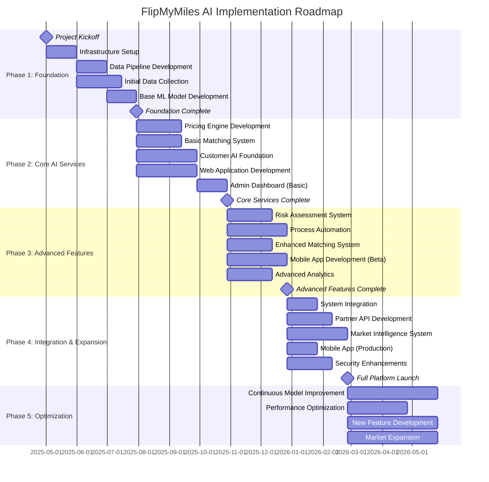

# FlipMyMiles AI Implementation Roadmap

## Overview

This document outlines the phased implementation approach for transforming FlipMyMiles into an AI-powered platform. The roadmap is designed to deliver value incrementally while managing risk and ensuring business continuity.

## Implementation Principles

1. **Value-First Approach**: Prioritize features with highest ROI
2. **Incremental Delivery**: Release functionality in small, testable increments
3. **Continuous Learning**: Incorporate feedback and insights throughout the process
4. **Risk Mitigation**: Address high-risk components early with proper testing
5. **Business Continuity**: Ensure zero disruption to existing operations

## Phased Implementation

### Phase 1: Foundation (Months 1-3)

**Objective**: Establish the core infrastructure and data foundation

**Key Deliverables**:
- Data infrastructure and pipeline setup
- Core cloud architecture deployment
- Initial data collection and preparation
- Base ML model development and training
- Foundational API endpoints

**Success Criteria**:
- Operational data pipeline with 99.9% reliability
- Successful ingestion of historical transaction data
- Development environment fully operational
- Initial ML models achieving baseline accuracy metrics

### Phase 2: Core AI Services (Months 4-6)

**Objective**: Implement the primary AI services that deliver immediate business value

**Key Deliverables**:
- Dynamic pricing engine (v1)
- Basic matching system
- Customer AI foundation
- Web application with core functionality
- Initial admin dashboard

**Success Criteria**:
- Pricing recommendations within 5% of expert human pricing
- Matching system achieving 80% automation rate
- Customer AI handling 40% of basic inquiries
- Web application successfully processing end-to-end transactions

### Phase 3: Advanced Features (Months 7-9)

**Objective**: Enhance core services and add sophisticated AI capabilities

**Key Deliverables**:
- Risk assessment system
- Process automation for key workflows
- Enhanced matching system with inventory optimization
- Mobile application (beta)
- Advanced analytics dashboard

**Success Criteria**:
- Risk assessment achieving <1% false positive rate
- 70% reduction in manual processing time
- Matching system achieving 95% automation rate
- Successful beta testing of mobile application

### Phase 4: Integration & Expansion (Months 10-12)

**Objective**: Complete system integration and expand platform capabilities

**Key Deliverables**:
- Full system integration
- Partner API development
- Market intelligence system
- Mobile application (production)
- Advanced security features

**Success Criteria**:
- Seamless end-to-end process flow
- Successful onboarding of 3+ partners via API
- Market intelligence providing actionable insights
- Mobile application achieving feature parity with web

### Phase 5: Optimization & Innovation (Ongoing)

**Objective**: Continuously improve system performance and add innovative features

**Key Deliverables**:
- Continuous model improvement
- Performance optimization
- New feature development
- Expansion to additional markets/programs

**Success Criteria**:
- Quarterly improvement in key performance metrics
- Successful deployment of 2+ innovative features annually
- Expansion to at least 3 new market segments

## Detailed Implementation Gantt Chart

## Resource Requirements

### Team Composition

| Role | Phase 1 | Phase 2 | Phase 3 | Phase 4 | Phase 5 |
|------|---------|---------|---------|---------|---------|
| Project Manager | 1 | 1 | 1 | 1 | 1 |
| Data Engineers | 2 | 2 | 2 | 2 | 1 |
| ML Engineers | 2 | 3 | 3 | 3 | 2 |
| Full-Stack Developers | 2 | 3 | 4 | 4 | 3 |
| DevOps Engineers | 1 | 1 | 2 | 2 | 1 |
| UX/UI Designers | 1 | 2 | 2 | 1 | 1 |
| QA Engineers | 1 | 2 | 2 | 2 | 1 |
| Domain Experts | 1 | 2 | 2 | 2 | 1 |
| **Total** | **11** | **16** | **18** | **17** | **11** |

### Infrastructure Requirements

| Resource | Phase 1 | Phase 2 | Phase 3 | Phase 4 | Phase 5 |
|----------|---------|---------|---------|---------|---------|
| Cloud Compute (cores) | 32 | 64 | 96 | 128 | 128+ |
| Storage (TB) | 5 | 10 | 20 | 30 | 40+ |
| GPU Instances | 2 | 4 | 6 | 8 | 8+ |
| Database Instances | 4 | 6 | 8 | 10 | 12+ |
| CI/CD Pipelines | Basic | Standard | Advanced | Advanced | Enterprise |
| Monitoring | Basic | Standard | Advanced | Advanced | Enterprise |

## Risk Management

| Risk | Impact | Probability | Mitigation Strategy |
|------|--------|------------|---------------------|
| Data quality issues | High | Medium | Implement robust data validation, cleansing processes |
| ML model performance below expectations | High | Medium | Staged rollout, A/B testing, human-in-the-loop fallback |
| Integration challenges with legacy systems | Medium | High | Thorough API design, adapter pattern implementation |
| Security vulnerabilities | High | Low | Regular security audits, penetration testing |
| Regulatory compliance issues | High | Medium | Compliance review at each phase, legal consultation |
| User adoption resistance | Medium | Medium | Change management, training, phased rollout |
| Technical debt accumulation | Medium | Medium | Code reviews, refactoring sprints, technical excellence metrics |

## Key Performance Indicators

### Technical KPIs

- System uptime (target: 99.9%)
- API response time (target: <200ms)
- ML model accuracy (target: >90%)
- Code quality metrics (coverage, complexity)
- Deployment frequency (target: 2+ per week)

### Business KPIs

- Transaction processing time (target: 80% reduction)
- Customer service automation rate (target: 70%)
- Pricing optimization accuracy (target: within 3% of optimal)
- Customer satisfaction score (target: >4.5/5)
- Revenue per transaction (target: 15% increase)

## Governance Structure

### Steering Committee
- CEO
- CTO
- Head of Operations
- Project Manager
- Lead ML Engineer

### Meeting Cadence
- Daily: Development team standup
- Weekly: Project status review
- Bi-weekly: Steering committee review
- Monthly: All-hands project review
- Quarterly: Strategic review and roadmap adjustment

## Conclusion

This implementation roadmap provides a structured approach to transforming FlipMyMiles into an AI-powered platform. By following this phased approach, the company can manage risks effectively while delivering incremental value throughout the project lifecycle. Regular reviews and adjustments to the roadmap will ensure alignment with business objectives and adaptation to changing market conditions.
