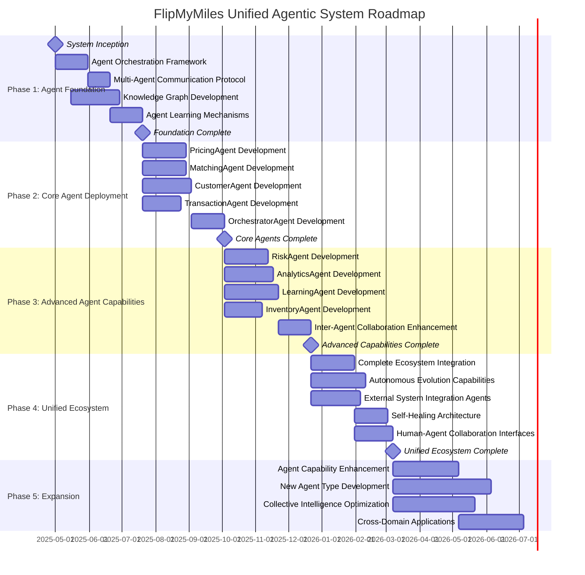

# FlipMyMiles Unified Agentic System Implementation Roadmap

## Overview

This document outlines the phased implementation approach for transforming FlipMyMiles into a unified agentic system. Unlike traditional development approaches, this roadmap focuses on deploying an interconnected network of specialized AI agents that work together to automate and optimize the entire miles and points marketplace ecosystem.

## Agentic Implementation Principles

1. **Agent Autonomy**: Design agents that can operate independently within their domains
2. **Unified Orchestration**: Ensure seamless coordination between specialized agents
3. **Continuous Adaptation**: Build agents that learn and improve from every transaction
4. **Emergent Intelligence**: Create a system where the whole is greater than the sum of its parts
5. **Human-AI Collaboration**: Maintain meaningful human oversight while maximizing automation

## Agentic System Implementation

### Phase 1: Agent Foundation (Months 1-3)

**Objective**: Establish the core agent architecture and knowledge base

**Key Deliverables**:
- Agent orchestration framework
- Multi-agent communication protocol
- Knowledge graph integration
- Agent learning mechanisms
- Baseline agent capabilities

**Success Criteria**:
- Agent communication latency <100ms
- Knowledge graph with 95% domain coverage
- Agent decision accuracy baseline established
- Successful multi-agent coordination demonstrations

### Phase 2: Core Agent Deployment (Months 4-6)

**Objective**: Deploy the primary specialized agents that deliver immediate business value

**Key Deliverables**:
- PricingAgent with real-time market awareness
- MatchingAgent with optimization capabilities
- CustomerAgent with natural conversation abilities
- TransactionAgent with secure processing
- OrchestratorAgent for system coordination

**Success Criteria**:
- PricingAgent decisions within 3% of optimal
- MatchingAgent achieving 85% perfect match rate
- CustomerAgent resolving 60% of inquiries autonomously
- TransactionAgent processing complete transactions with zero errors

### Phase 3: Advanced Agent Capabilities (Months 7-9)

**Objective**: Enhance agent intelligence and add specialized agent types

**Key Deliverables**:
- RiskAgent with advanced fraud detection
- AnalyticsAgent for market intelligence
- LearningAgent for system-wide optimization
- InventoryAgent for predictive management
- Enhanced inter-agent collaboration protocols

**Success Criteria**:
- RiskAgent achieving <0.5% false positive rate
- 90% reduction in human intervention requirements
- Emergent intelligence demonstrating novel problem-solving
- Agent adaptation to changing market conditions

### Phase 4: Unified Agentic Ecosystem (Months 10-12)

**Objective**: Create a fully integrated, self-improving agent ecosystem

**Key Deliverables**:
- Complete agent ecosystem integration
- Autonomous agent evolution capabilities
- External system integration agents
- Self-healing system architecture
- Advanced human-agent collaboration interfaces

**Success Criteria**:
- End-to-end autonomous operation with minimal oversight
- Successful adaptation to unexpected scenarios
- Continuous self-improvement of agent capabilities
- Seamless integration with external platforms

### Phase 5: Agentic Intelligence Expansion (Ongoing)

**Objective**: Continuously evolve the agent ecosystem and expand capabilities

**Key Deliverables**:
- Agent capability expansion
- New specialized agent types
- Enhanced collective intelligence
- Cross-domain agent applications

**Success Criteria**:
- Monthly improvement in agent performance metrics
- Successful deployment of new agent types quarterly
- Expansion to adjacent business domains
- Emergent capabilities not explicitly programmed

## Unified Agentic System Roadmap

## System Requirements

### Agent Ecosystem Components

| Agent Type | Phase 1 | Phase 2 | Phase 3 | Phase 4 | Phase 5 |
|------------|---------|---------|---------|---------|---------|
| OrchestratorAgent | Prototype | v1.0 | v2.0 | v3.0 | v4.0+ |
| PricingAgent | - | v1.0 | v2.0 | v3.0 | v4.0+ |
| MatchingAgent | - | v1.0 | v2.0 | v3.0 | v4.0+ |
| CustomerAgent | - | v1.0 | v2.0 | v3.0 | v4.0+ |
| TransactionAgent | - | v1.0 | v2.0 | v3.0 | v4.0+ |
| RiskAgent | - | - | v1.0 | v2.0 | v3.0+ |
| AnalyticsAgent | - | - | v1.0 | v2.0 | v3.0+ |
| LearningAgent | - | - | v1.0 | v2.0 | v3.0+ |
| InventoryAgent | - | - | v1.0 | v2.0 | v3.0+ |
| IntegrationAgents | - | - | - | v1.0 | v2.0+ |
| SpecialtyAgents | - | - | - | - | v1.0+ |

### Computational Resources

| Resource | Phase 1 | Phase 2 | Phase 3 | Phase 4 | Phase 5 |
|----------|---------|---------|---------|---------|---------|
| Agent Processing Units | 50 | 200 | 500 | 1,000 | 2,000+ |
| Knowledge Storage (TB) | 10 | 25 | 50 | 100 | 250+ |
| Agent Learning Capacity | Basic | Standard | Advanced | Self-Improving | Emergent |
| Communication Bandwidth | 10 Gbps | 25 Gbps | 50 Gbps | 100 Gbps | 200+ Gbps |
| Redundancy Systems | Basic | Standard | Advanced | Self-Healing | Autonomous |
| Human Oversight Interfaces | Comprehensive | Selective | Exception-Based | Minimal | Strategic Only |

## Agentic System Risk Management

| Risk | Impact | Probability | Mitigation Strategy |
|------|--------|------------|---------------------|
| Agent decision-making errors | Critical | Medium | Multi-agent verification, confidence thresholds, human oversight for critical decisions |
| Agent communication failures | High | Low | Redundant communication channels, self-healing protocols, graceful degradation |
| Knowledge graph inconsistencies | High | Medium | Continuous validation, automatic reconciliation, versioned knowledge |
| Emergent behavior anomalies | High | Medium | Behavioral boundaries, containment protocols, agent sandboxing |
| Agent learning drift | Medium | High | Regular calibration, performance benchmarking, learning guardrails |
| Security compromises | Critical | Low | Agent authentication, encrypted communications, behavior monitoring |
| Regulatory compliance issues | High | Medium | Compliance agents, audit trails, explainable agent decisions |
| Human-agent collaboration friction | Medium | Medium | Intuitive interfaces, preference learning, adaptive interaction models |
| Agent resource contention | Medium | Medium | Dynamic resource allocation, priority frameworks, load balancing |

## Agentic System Performance Indicators

### Agent Performance Metrics

- Agent decision accuracy (target: >98%)
- Agent response time (target: <50ms)
- Inter-agent communication efficiency (target: >99.9%)
- Knowledge utilization rate (target: >95%)
- Agent learning velocity (target: 5% improvement per week)
- Emergent capability development (target: 1+ new capability per month)

### Business Impact Metrics

- End-to-end transaction automation (target: 95%)
- Human intervention requirements (target: <5% of transactions)
- Decision optimization accuracy (target: within 1% of theoretical optimal)
- System adaptability to market changes (target: <12 hours)
- Customer satisfaction with agent interactions (target: >4.8/5)
- Revenue per agent processing unit (target: 25% increase quarterly)

## Agentic System Governance

### Oversight Council
- CEO (Strategic Direction)
- Chief AI Officer (System Architecture)
- Head of Operations (Business Integration)
- Ethics Advisor (Responsible AI)
- Customer Advocate (User Experience)

### Agent Governance Framework
- **Agent Performance Review**: Continuous automated evaluation of agent decisions and actions
- **Emergent Behavior Analysis**: Weekly review of unexpected agent behaviors and capabilities
- **Human-Agent Interaction**: Bi-weekly assessment of collaboration effectiveness
- **System Evolution**: Monthly strategic direction for agent ecosystem development
- **Ethical Alignment**: Quarterly review of agent decision-making against ethical principles

## Conclusion

This implementation roadmap provides a structured approach to transforming FlipMyMiles into a unified agentic system. Unlike traditional development approaches that rely on human developers and rigid software components, this agentic ecosystem will continuously learn, adapt, and evolve to optimize the miles and points marketplace.

The key advantage of this approach is the elimination of traditional development bottlenecks and the creation of a truly autonomous system that can respond to market changes in real-time. By deploying specialized agents that work together as a unified intelligence, FlipMyMiles will achieve levels of efficiency, accuracy, and customer experience that would be impossible with conventional approaches.

As the agent ecosystem matures, we expect to see emergent capabilities that weren't explicitly programmed - novel solutions to complex problems that arise from the collective intelligence of the system. This represents a fundamental shift from software that needs to be maintained and updated by humans to an autonomous system that improves itself.

The unified agentic system approach positions FlipMyMiles not just as a technology leader in the miles and points brokerage industry, but as a pioneer in the application of advanced AI to create business value through true automation and intelligence.
