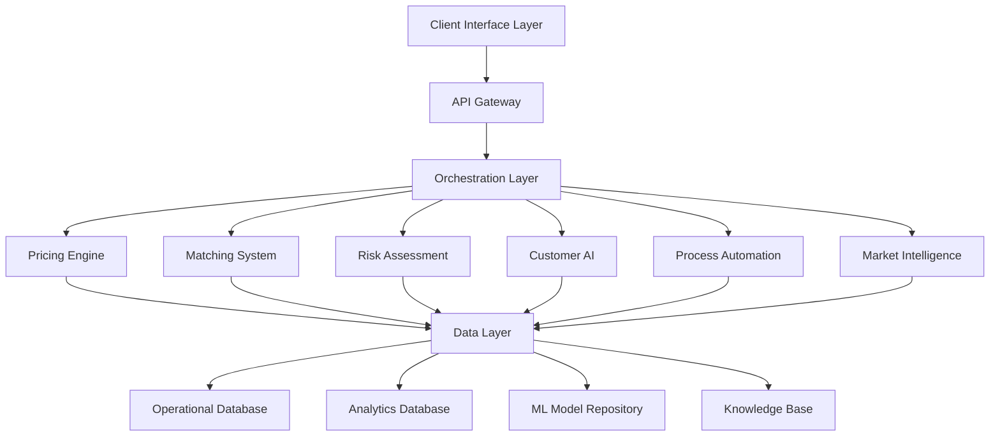
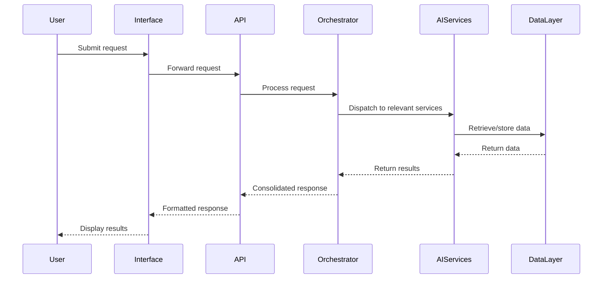
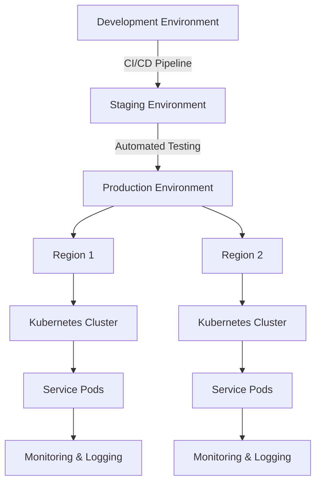

# FlipMyMiles AI System Architecture

## System Overview

The FlipMyMiles AI Optimization Platform is designed as a modular, scalable architecture that integrates multiple AI components to create a unified agentic system. This document outlines the technical architecture and components required to implement the AI-driven optimization strategy.

## High-Level Architecture

## Core Components

### 1. Client Interface Layer

**Purpose**: Provide intuitive interfaces for all user types (sellers, buyers, administrators)

**Components**:
- **Web Application**: Responsive React-based frontend
- **Mobile Application**: React Native implementation for iOS/Android
- **Admin Dashboard**: Advanced management interface with analytics
- **Partner API**: REST API for B2B integrations

**AI Integration**:
- Personalized UI/UX based on user behavior
- Intelligent form completion and suggestions
- Natural language search capabilities
- Adaptive interface based on user proficiency

### 2. API Gateway

**Purpose**: Unified entry point for all services with authentication, rate limiting, and routing

**Components**:
- **Authentication Service**: OAuth 2.0 with MFA
- **Rate Limiting**: Adaptive rate limiting based on user tier and behavior
- **Request Routing**: Intelligent routing to appropriate microservices
- **API Documentation**: Auto-generated OpenAPI documentation

**AI Integration**:
- Anomaly detection for security threats
- Dynamic rate limiting based on behavior patterns
- Smart caching strategies

### 3. Orchestration Layer

**Purpose**: Coordinate workflows across multiple AI services and manage business processes

**Components**:
- **Workflow Engine**: Event-driven process orchestration
- **Service Mesh**: Inter-service communication management
- **Event Bus**: Publish-subscribe system for event distribution
- **State Management**: Distributed state tracking for transactions

**AI Integration**:
- Adaptive workflow optimization
- Predictive resource allocation
- Intelligent retry and error handling strategies

### 4. AI Service Modules

#### 4.1 Pricing Engine

**Purpose**: Determine optimal buying and selling prices for miles/points

**Components**:
- **Price Prediction Models**: ML models for value forecasting
- **Market Analysis Engine**: Competitive and trend analysis
- **Optimization Algorithm**: Multi-factor price optimization
- **Scenario Simulator**: What-if analysis for pricing strategies

**Technologies**:
- TensorFlow/PyTorch for deep learning models
- Bayesian optimization for pricing strategies
- Time series analysis for trend prediction
- Reinforcement learning for strategy optimization

#### 4.2 Matching System

**Purpose**: Efficiently pair buyers and sellers based on multiple criteria

**Components**:
- **Matching Algorithm**: Multi-constraint optimization
- **Inventory Management**: Predictive inventory control
- **Order Bundling**: Intelligent aggregation of smaller orders
- **Fulfillment Optimizer**: Optimal allocation of available points

**Technologies**:
- Graph neural networks for relationship modeling
- Constraint satisfaction algorithms
- Multi-objective optimization
- Genetic algorithms for complex matching scenarios

#### 4.3 Risk Assessment

**Purpose**: Evaluate and mitigate risks associated with transactions

**Components**:
- **Fraud Detection**: ML-based anomaly detection
- **Compliance Checker**: Automated policy verification
- **Risk Scoring**: Multi-factor risk evaluation
- **Identity Verification**: Advanced KYC/AML systems

**Technologies**:
- Anomaly detection using autoencoders
- NLP for policy analysis and compliance
- Random forest/XGBoost for risk classification
- Biometric verification integration

#### 4.4 Customer AI

**Purpose**: Enhance customer experience through intelligent interactions

**Components**:
- **Conversational Agent**: NLP-powered chatbot
- **Recommendation Engine**: Personalized suggestions
- **Sentiment Analysis**: Customer feedback interpretation
- **Customer Segmentation**: Behavioral clustering

**Technologies**:
- Transformer-based NLP models (BERT/GPT)
- Collaborative filtering for recommendations
- LSTM/RNN for conversation management
- Clustering algorithms for segmentation

#### 4.5 Process Automation

**Purpose**: Automate manual workflows and operational processes

**Components**:
- **Document Processor**: Intelligent document parsing
- **Task Automation**: RPA for repetitive tasks
- **Quality Control**: Automated verification systems
- **Exception Handling**: Intelligent error resolution

**Technologies**:
- Computer vision for document analysis
- Process mining for workflow optimization
- Decision trees for exception routing
- Robotic Process Automation (RPA) integration

#### 4.6 Market Intelligence

**Purpose**: Gather and analyze market data for strategic insights

**Components**:
- **Data Collection**: Automated market data gathering
- **Trend Analysis**: Pattern recognition in market data
- **Competitive Intelligence**: Competitor monitoring
- **Opportunity Detector**: Identification of market gaps

**Technologies**:
- Web scraping with ethical considerations
- NLP for unstructured data analysis
- Time series forecasting
- Clustering for market segmentation

### 5. Data Layer

**Purpose**: Manage all data assets and provide unified access

**Components**:
- **Operational Database**: Transaction and user data (PostgreSQL)
- **Analytics Database**: Data warehouse for analysis (Snowflake)
- **ML Model Repository**: Version-controlled model storage
- **Knowledge Base**: Structured industry information

**Technologies**:
- Data lake architecture (Delta Lake/Iceberg)
- ETL/ELT pipelines (Airflow)
- Feature store for ML features
- Graph database for relationship modeling

## Integration Architecture

## Deployment Architecture

The system will be deployed using a cloud-native approach with the following components:

- **Infrastructure**: AWS/Azure/GCP with multi-region deployment
- **Containerization**: Docker containers for all services
- **Orchestration**: Kubernetes for container management
- **CI/CD**: Automated pipeline for continuous deployment
- **Monitoring**: Comprehensive observability stack
- **Security**: Defense-in-depth approach with encryption, IAM, and security scanning

## Security Architecture

Security is implemented at multiple levels:

- **Data Security**: Encryption at rest and in transit
- **Application Security**: OWASP compliance, regular security testing
- **Infrastructure Security**: Network isolation, firewall rules
- **Identity Security**: Strong authentication, least privilege access
- **Operational Security**: Automated threat detection, incident response

## AI Ethics and Governance

The system implements responsible AI practices:

- **Fairness**: Regular bias auditing in ML models
- **Transparency**: Explainable AI approaches where possible
- **Privacy**: Privacy-by-design principles
- **Compliance**: Adherence to relevant regulations
- **Oversight**: Human review of critical AI decisions

## Scalability Considerations

The architecture is designed to scale in multiple dimensions:

- **Horizontal Scaling**: Adding more instances of services
- **Vertical Scaling**: Increasing resources for compute-intensive tasks
- **Data Scaling**: Distributed data storage and processing
- **Geographic Scaling**: Multi-region deployment for global reach
- **Feature Scaling**: Modular design for adding new capabilities

## Implementation Roadmap

The implementation will follow a phased approach:

1. **Foundation Phase** (Months 1-3):
   - Core infrastructure setup
   - Data pipeline establishment
   - Initial ML model development

2. **Core Services Phase** (Months 4-6):
   - Pricing Engine implementation
   - Basic Matching System
   - Customer AI foundation

3. **Advanced Features Phase** (Months 7-9):
   - Risk Assessment system
   - Process Automation
   - Enhanced Matching System

4. **Integration Phase** (Months 10-12):
   - Full system integration
   - Partner API development
   - Advanced analytics dashboard

5. **Optimization Phase** (Ongoing):
   - Continuous model improvement
   - Performance optimization
   - New feature development

## Conclusion

This architecture provides a comprehensive framework for transforming FlipMyMiles into an AI-driven platform. The modular design allows for incremental implementation while ensuring that each component can evolve independently. By following this architecture, FlipMyMiles can achieve significant operational efficiencies, enhanced customer experiences, and a sustainable competitive advantage in the marketplace.
