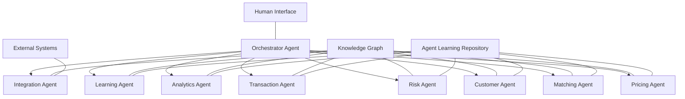
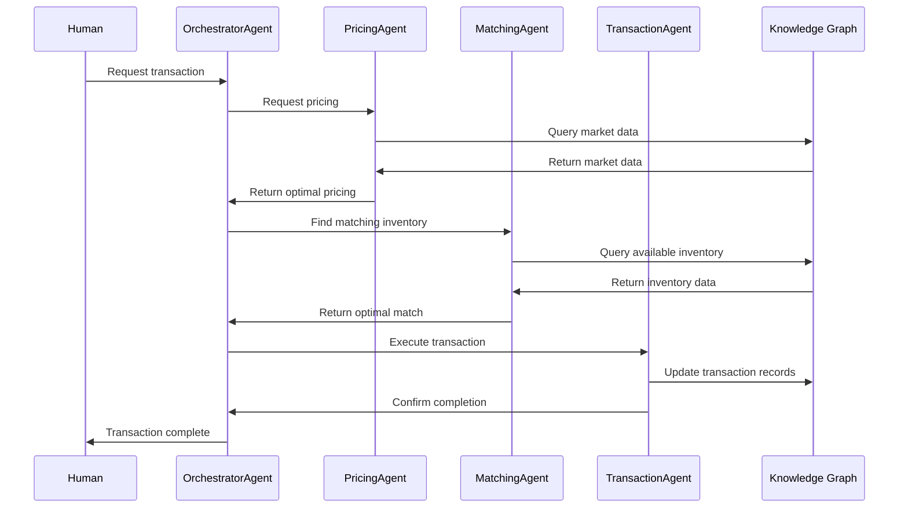
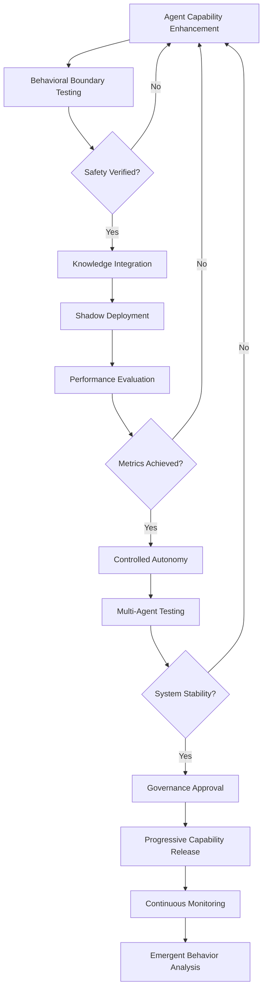

# FlipMyMiles Unified Agentic System Implementation Guide

## Overview

This document provides detailed technical specifications for implementing the FlipMyMiles unified agentic system. Unlike traditional development approaches, this implementation focuses on creating an interconnected ecosystem of specialized AI agents that work together autonomously to optimize the miles and points marketplace.

## Agentic System Architecture

### Agent Foundation Layer

| Component | Technology | Purpose |
|-----------|------------|---------|
| Agent Runtime | Autonomous Agent Framework | Execution environment for all agents |
| Knowledge Graph | Neo4j, Vector Database | Shared knowledge representation |
| Agent Communication Protocol | Event-driven Mesh | Inter-agent messaging and coordination |
| Learning Framework | Reinforcement Learning, Transfer Learning | Agent adaptation and improvement |
| Orchestration Engine | Multi-agent Coordination System | Agent task distribution and oversight |

### Specialized Agent Types

| Agent Type | Capabilities | Purpose |
|-----------|------------|---------|
| PricingAgent | Market analysis, Value optimization | Determine optimal pricing for miles/points |
| MatchingAgent | Pattern recognition, Optimization | Connect buyers and sellers efficiently |
| CustomerAgent | Natural language, Emotion recognition | Handle all customer interactions |
| TransactionAgent | Secure processing, Verification | Execute and monitor transactions |
| RiskAgent | Anomaly detection, Pattern analysis | Identify and mitigate risks |
| AnalyticsAgent | Data analysis, Trend recognition | Generate market insights |
| LearningAgent | Meta-learning, Knowledge distillation | Improve overall system intelligence |
| IntegrationAgent | Protocol adaptation, Data transformation | Connect with external systems |

### Agent Intelligence Technologies

| Component | Technology | Purpose |
|-----------|------------|---------|
| Perception Systems | Transformer Models, Multimodal AI | Process and understand various inputs |
| Reasoning Engines | Symbolic AI, Neural-symbolic Systems | Make decisions based on knowledge |
| Learning Mechanisms | Deep RL, Federated Learning | Improve agent capabilities over time |
| Communication Systems | Natural Language Generation, Semantic Protocols | Enable agent-agent and agent-human interaction |
| Memory Systems | Episodic and Semantic Memory | Store and retrieve experiences and knowledge |

### Knowledge Infrastructure

| Component | Technology | Purpose |
|-----------|------------|---------|
| Domain Knowledge | Ontologies, Knowledge Graphs | Represent miles/points domain expertise |
| Operational Memory | Distributed Graph Database | Store transaction and entity relationships |
| Learning Repository | Vector Database | Store embeddings and patterns |
| Collective Intelligence | Federated Knowledge Base | Share insights across agent ecosystem |
| External Knowledge | API Connections, Web Knowledge | Access to external information sources |

### Autonomous Infrastructure

| Component | Technology | Purpose |
|-----------|------------|---------|
| Self-healing Systems | Autonomous Recovery Agents | Maintain system integrity |
| Resource Management | Dynamic Allocation System | Optimize computational resources |
| Security Framework | Zero-trust Agent Authentication | Ensure system security |
| Monitoring Systems | Self-awareness Agents | Track system health and performance |
| Adaptation Framework | Evolutionary Architecture | Enable system to evolve over time |

## Unified Agentic System Implementation

### Agent Ecosystem Architecture

The system will be implemented as an interconnected ecosystem of specialized autonomous agents working together:



### Agent Responsibilities

1. **OrchestratorAgent**
   - Coordinates all agent activities
   - Manages task allocation and prioritization
   - Monitors system performance
   - Handles exception scenarios
   - Maintains system coherence

2. **PricingAgent**
   - Continuously analyzes market conditions
   - Determines optimal pricing for miles/points
   - Predicts future value trends
   - Identifies arbitrage opportunities
   - Adapts to program changes

3. **MatchingAgent**
   - Identifies optimal buyer-seller matches
   - Manages inventory allocation
   - Optimizes fulfillment strategies
   - Predicts future inventory needs
   - Maximizes transaction value

4. **CustomerAgent**
   - Handles all customer interactions
   - Understands customer intent and emotion
   - Provides personalized recommendations
   - Learns from customer preferences
   - Maintains conversation context

5. **RiskAgent**
   - Detects fraudulent activities
   - Assesses transaction risk
   - Monitors compliance with regulations
   - Adapts to new fraud patterns
   - Implements verification protocols

6. **TransactionAgent**
   - Executes secure transactions
   - Manages payment processing
   - Maintains immutable transaction records
   - Handles exceptions and reconciliation
   - Optimizes transaction flow

7. **AnalyticsAgent**
   - Analyzes market trends
   - Identifies business opportunities
   - Generates actionable insights
   - Creates performance reports
   - Detects anomalies and patterns

8. **LearningAgent**
   - Improves other agents' capabilities
   - Identifies knowledge gaps
   - Transfers learning across agents
   - Experiments with new strategies
   - Optimizes collective intelligence

9. **IntegrationAgent**
   - Connects with external systems
   - Transforms data between formats
   - Maintains API compatibility
   - Monitors external dependencies
   - Adapts to external changes

### Agent Communication Protocol

Agents communicate through a semantic event-driven protocol:



Each agent communication includes:
- Semantic intent
- Confidence level
- Context information
- Priority level
- Execution constraints
- Expected response format

## Specialized Agent Implementation

### 1. PricingAgent Implementation

#### Intelligence Architecture

The PricingAgent will utilize multiple cognitive systems:

1. **Market Perception System**
   - Real-time market data processing
   - Program-specific value recognition
   - Competitive landscape awareness
   - Seasonal pattern identification

2. **Value Prediction System**
   - Temporal value forecasting
   - Multi-program correlation analysis
   - Economic factor integration
   - Confidence-based predictions

3. **Strategy Optimization System**
   - Adaptive pricing strategies
   - Multi-objective optimization
   - Risk-aware decision making
   - Continuous strategy evolution

#### Knowledge Requirements

- Complete loyalty program ontology
- Historical transaction patterns
- Market dynamics knowledge graph
- Value correlation networks
- Pricing strategy repository

#### Learning Mechanisms

1. Continuous market observation
2. Strategy performance evaluation
3. Value prediction refinement
4. Cross-program knowledge transfer
5. Anomaly-driven adaptation

#### Performance Capabilities

- Value prediction accuracy > 98%
- Strategy optimization gain > 25%
- Market adaptation time < 30 seconds
- Anomaly detection precision > 99%

### 2. MatchingAgent Implementation

#### Intelligence Architecture

The MatchingAgent will utilize specialized cognitive systems:

1. **Pattern Recognition System**
   - Multi-dimensional similarity detection
   - Temporal alignment recognition
   - Preference compatibility analysis
   - Opportunity identification

2. **Optimization System**
   - Global utility maximization
   - Multi-constraint satisfaction
   - Dynamic priority adjustment
   - Adaptive matching strategies

3. **Inventory Intelligence**
   - Predictive inventory management
   - Supply-demand forecasting
   - Optimal allocation planning
   - Expiration risk mitigation

#### Knowledge Structures

- Transaction possibility space
- Preference compatibility network
- Temporal opportunity map
- Value optimization patterns
- Historical match outcomes

#### Learning Mechanisms

1. Match outcome evaluation
2. Preference pattern discovery
3. Strategy performance analysis
4. Constraint satisfaction optimization
5. Novel matching pattern generation

#### Performance Capabilities

- Match quality score > 97%
- Global optimization efficiency > 95%
- Match discovery time < 100ms
- Inventory utilization rate > 99%

### 3. RiskAgent Implementation

#### Intelligence Architecture

The RiskAgent will utilize specialized security systems:

1. **Anomaly Detection System**
   - Behavioral pattern analysis
   - Multi-dimensional outlier detection
   - Temporal sequence analysis
   - Contextual anomaly recognition

2. **Threat Assessment System**
   - Risk vector identification
   - Vulnerability analysis
   - Impact prediction
   - Confidence-based risk scoring

3. **Compliance Intelligence**
   - Regulatory knowledge integration
   - Policy alignment verification
   - Compliance gap detection
   - Adaptive rule interpretation

#### Knowledge Requirements

- Fraud pattern repository
- Behavioral norm models
- Regulatory framework ontology
- Risk assessment heuristics
- Security protocol knowledge

#### Learning Mechanisms

1. Continuous threat monitoring
2. False positive/negative analysis
3. New pattern discovery
4. Cross-domain threat intelligence
5. Regulatory update integration

#### Performance Capabilities

- Fraud detection accuracy > 99.5%
- False positive rate < 0.1%
- Risk assessment time < 50ms
- Adaptation to new threats < 1 hour

### 4. CustomerAgent Implementation

#### Intelligence Architecture

The CustomerAgent will utilize human-centered systems:

1. **Natural Language Understanding**
   - Intent recognition
   - Sentiment analysis
   - Context maintenance
   - Implicit need identification

2. **Personalization Intelligence**
   - Individual preference modeling
   - Behavioral pattern recognition
   - Satisfaction prediction
   - Adaptive interaction style

3. **Conversation Management**
   - Dynamic dialogue planning
   - Multi-turn reasoning
   - Explanation generation
   - Emotional intelligence

#### Knowledge Structures

- Conversation context graph
- Customer preference models
- Interaction history memory
- Domain-specific knowledge
- Satisfaction indicators

#### Learning Mechanisms

1. Interaction outcome analysis
2. Preference inference
3. Conversation effectiveness evaluation
4. Response quality improvement
5. Customer satisfaction optimization

#### Performance Capabilities

- Intent understanding accuracy > 98%
- Customer satisfaction score > 4.9/5
- Response generation time < 100ms
- Personalization effectiveness > 95%

## Knowledge Representation Architecture

### Core Knowledge Structures

#### Knowledge Graph Schema

```cypher
// Entity Types
CREATE (:Entity:User {id: string, attributes: map})
CREATE (:Entity:LoyaltyProgram {id: string, attributes: map})
CREATE (:Entity:Transaction {id: string, attributes: map})
CREATE (:Entity:Inventory {id: string, attributes: map})
CREATE (:Entity:Market {id: string, attributes: map})

// Relationship Types
CREATE ()-[:PARTICIPATES_IN]->(:LoyaltyProgram)
CREATE (:User)-[:OWNS]->(:Inventory)
CREATE (:User)-[:INITIATED]->(:Transaction)
CREATE (:Transaction)-[:INVOLVES]->(:LoyaltyProgram)
CREATE (:LoyaltyProgram)-[:HAS_VALUATION {date: date, value: float}]->(:Market)
CREATE (:Entity)-[:HAS_PREFERENCE {strength: float}]->(:Entity)
CREATE (:Entity)-[:RELATED_TO {type: string, strength: float}]->(:Entity)
```

#### Semantic Vector Spaces

```python
# Entity Embeddings
class EntityEmbedding:
    entity_id: str
    embedding: Vector[1024]  # High-dimensional vector representation
    entity_type: str
    confidence: float
    last_updated: timestamp
    context_factors: Dict[str, float]

# Relationship Embeddings
class RelationshipEmbedding:
    source_id: str
    target_id: str
    relationship_type: str
    embedding: Vector[512]  # Relationship-specific embedding
    strength: float
    temporal_factors: Dict[str, float]
```

#### Temporal Knowledge Structures

```json
{
  "temporal_patterns": {
    "program_valuations": {
      "seasonal_patterns": [
        {
          "program_id": "program-123",
          "pattern_type": "seasonal_peak",
          "timeframe": "december",
          "confidence": 0.92,
          "historical_evidence": [...]
        }
      ],
      "trend_patterns": [...],
      "cyclical_patterns": [...]
    },
    "transaction_volumes": {...},
    "user_behaviors": {...}
  }
}
```

#### Agent Memory Structures

```typescript
interface AgentMemory {
  episodic: {
    interactions: Array<{
      timestamp: Date;
      entities: string[];
      actions: string[];
      outcomes: string[];
      importance: number;
    }>;
  };
  semantic: {
    concepts: Map<string, {
      definition: string;
      relationships: Array<{
        concept: string;
        strength: number;
      }>;
      confidence: number;
    }>;
  };
  procedural: {
    strategies: Map<string, {
      context: string;
      steps: string[];
      effectiveness: number;
      last_used: Date;
    }>;
  };
}
```

#### Collective Intelligence Repository

```json
{
  "emergent_patterns": [
    {
      "pattern_id": "EP-2025-03-15-001",
      "description": "Correlation between airline program devaluations and increased selling activity",
      "confidence": 0.89,
      "discovery_agent": "AnalyticsAgent",
      "supporting_evidence": [...],
      "applications": [
        {
          "agent": "PricingAgent",
          "usage": "Predictive pricing adjustment",
          "effectiveness": 0.94
        },
        {
          "agent": "MatchingAgent",
          "usage": "Inventory pre-allocation",
          "effectiveness": 0.87
        }
      ]
    }
  ],
  "cross_domain_insights": [...],
  "strategy_evaluations": [...]
}
```

## Agentic Security Framework

### Agent Authentication & Trust

1. **Agent Identity Verification**
   - Cryptographic agent signatures
   - Behavioral fingerprinting
   - Multi-factor agent verification
   - Continuous identity validation

2. **Trust Establishment Protocol**
   - Zero-trust agent interactions
   - Progressive trust building
   - Reputation-based trust scoring
   - Context-aware trust boundaries

3. **Authority Management**
   - Dynamic capability assignment
   - Least-privilege principle enforcement
   - Authority delegation protocols
   - Authority verification chains

### Knowledge Security

1. **Knowledge Integrity Protection**
   - Tamper-evident knowledge structures
   - Cryptographic knowledge validation
   - Version-controlled knowledge states
   - Knowledge consistency verification

2. **Sensitive Information Handling**
   - Information classification by agents
   - Selective knowledge sharing
   - Privacy-preserving computation
   - Knowledge access auditing

3. **Knowledge Provenance**
   - Source attribution tracking
   - Confidence scoring for knowledge
   - Lineage tracking for derived insights
   - Knowledge decay management

### Agent Behavior Security

1. **Behavioral Boundaries**
   - Action authorization framework
   - Ethical constraint enforcement
   - Impact prediction before action
   - Multi-agent approval for critical actions

2. **Anomaly Detection**
   - Agent behavior monitoring
   - Deviation analysis
   - Intention verification
   - Behavioral pattern validation

3. **Security Response Agents**
   - Dedicated security monitoring agents
   - Autonomous threat response
   - Agent isolation capabilities
   - System-wide security coordination

## Agentic Ecosystem Deployment

### Cognitive Environment Tiers

1. **Development Cognitive Space**
   - Agent sandbox environments
   - Simulated knowledge graphs
   - Behavioral boundary testing
   - Capability development workbenches
   - Agent interaction simulators

2. **Staging Cognitive Space**
   - Controlled agent autonomy zones
   - Shadow-mode capability testing
   - Knowledge consistency verification
   - Multi-agent interaction validation
   - Performance boundary testing

3. **Production Cognitive Space**
   - Multi-region agent distribution
   - Dynamic capability scaling
   - Resilient knowledge persistence
   - Adaptive resource allocation
   - Self-healing agent infrastructure

### Agent Evolution Pipeline



## Agent Verification Framework

### Capability Verification

- Cognitive capability assessment
- Decision quality evaluation
- Knowledge utilization measurement
- Reasoning path validation
- Continuous capability monitoring

### Multi-Agent Interaction Testing

- Collaborative problem-solving scenarios
- Resource contention resolution
- Knowledge sharing effectiveness
- Communication protocol verification
- Emergent behavior detection

### Cognitive Performance Assessment

- Decision latency under various loads
- Knowledge retrieval efficiency
- Adaptation to novel scenarios
- Resource utilization optimization
- Cognitive scaling boundaries

### Security & Safety Verification

- Behavioral boundary enforcement
- Authority limitation verification
- Knowledge access control validation
- Adversarial scenario testing
- Ethical constraint adherence

### Alignment Verification

- Goal alignment validation
- Value consistency verification
- Intention-action coherence
- Unexpected consequence detection
- Human oversight effectiveness

## Cognitive System Observability

### Agent Intelligence Metrics

- Decision quality metrics
- Knowledge utilization efficiency
- Reasoning path complexity
- Learning rate measurements
- Adaptation velocity metrics

### Collective Intelligence Monitoring

- Inter-agent knowledge transfer rates
- Emergent pattern detection
- Collective problem-solving effectiveness
- System-wide learning curves
- Knowledge consistency measurements

### Cognitive Transparency

- Decision explanation tracing
- Confidence level monitoring
- Uncertainty quantification
- Alternative path exploration
- Intention-action alignment

### Autonomous Governance

- Behavioral boundary compliance
- Authority limitation adherence
- Ethical constraint monitoring
- Value alignment verification
- Human oversight effectiveness

### Cognitive Dashboards

- Agent capability evolution
- Knowledge graph growth visualization
- Emergent behavior patterns
- System-wide intelligence metrics
- Value creation measurements

## Agentic System Evolution Roadmap

### Phase 1: Cognitive Foundation (Months 1-3)

| Week | Task | Description |
|------|------|-------------|
| 1-2 | Knowledge Architecture | Knowledge graph design, ontology development, semantic structures |
| 3-4 | Agent Runtime Environment | Distributed cognitive environment, agent communication protocol |
| 5-6 | Core Knowledge Acquisition | Initial knowledge ingestion, domain expertise encoding |
| 7-8 | Base Agent Capabilities | Fundamental reasoning, perception, and action capabilities |
| 9-10 | Trust Framework | Agent identity verification, trust establishment protocol |
| 11-12 | Cognitive Sandbox | Agent testing environment, capability verification framework |

### Phase 2: Specialized Agent Development (Months 4-6)

| Week | Task | Description |
|------|------|-------------|
| 13-14 | PricingAgent v1 | Market perception system, value prediction capabilities |
| 15-16 | MatchingAgent v1 | Pattern recognition system, basic optimization strategies |
| 17-18 | CustomerAgent v1 | Natural language understanding, basic conversation management |
| 19-20 | TransactionAgent v1 | Secure processing capabilities, verification protocols |
| 21-22 | RiskAgent v1 | Basic anomaly detection, threat assessment capabilities |
| 23-24 | Multi-Agent Integration | Inter-agent communication, collective problem solving |

### Phase 3: Cognitive Enhancement (Months 7-9)

| Week | Task | Description |
|------|------|-------------|
| 25-26 | Advanced Learning Mechanisms | Cross-domain knowledge transfer, adaptive learning strategies |
| 27-28 | Collective Intelligence | Emergent pattern recognition, knowledge synthesis capabilities |
| 29-30 | Enhanced Decision Systems | Multi-objective optimization, confidence-based decision making |
| 31-32 | Human-Agent Collaboration | Intuitive interfaces, explanation generation, feedback integration |
| 33-34 | Autonomous Improvement | Self-evaluation, capability enhancement, knowledge refinement |
| 35-36 | Cognitive Performance Optimization | Reasoning efficiency, knowledge retrieval optimization |

### Phase 4: Ecosystem Maturation (Months 10-12)

| Week | Task | Description |
|------|------|-------------|
| 37-38 | Emergent Behavior Management | System-wide pattern detection, unexpected behavior governance |
| 39-40 | External Intelligence Integration | Third-party knowledge integration, external agent collaboration |
| 41-42 | Market Intelligence Network | Distributed perception system, strategic insight generation |
| 43-44 | Autonomous Security Enhancement | Self-healing capabilities, threat adaptation, security evolution |
| 45-46 | Progressive Capability Release | Controlled autonomy expansion, performance verification |
| 47-48 | Continuous Evolution Framework | Self-improvement mechanisms, adaptation protocols, governance |

## Conclusion

This technical implementation guide provides a comprehensive framework for developing the AI-optimized FlipMyMiles platform. By following this structured approach, the development team can efficiently implement the various components while ensuring integration, security, and performance requirements are met.

The modular architecture allows for incremental development and deployment, enabling early delivery of value while continuing to enhance the platform with advanced capabilities. Regular review and adjustment of the implementation plan will ensure alignment with business objectives and adaptation to technical challenges encountered during development.
