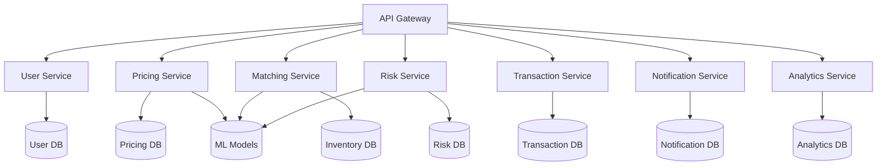
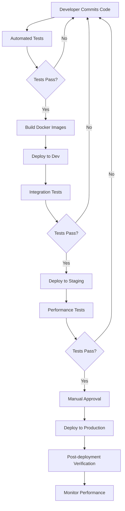

# FlipMyMiles AI Technical Implementation Guide

## Overview

This document provides detailed technical specifications for implementing the AI-optimized FlipMyMiles platform. It covers the technology stack, development approach, and specific implementation details for each AI component.

## Technology Stack

### Frontend Technologies

| Component | Technology | Purpose |
|-----------|------------|---------|
| Web Application | React.js, Redux, Material UI | Primary user interface for customers |
| Mobile Application | React Native | Cross-platform mobile experience |
| Admin Dashboard | React.js, D3.js, Nivo | Internal management and analytics |
| Partner Portal | React.js, GraphQL | B2B integration interface |

### Backend Technologies

| Component | Technology | Purpose |
|-----------|------------|---------|
| API Gateway | Express.js, Apollo Server | Unified entry point for all services |
| Microservices | Node.js, Python | Modular service architecture |
| Authentication | OAuth 2.0, JWT, Passport.js | Secure user authentication |
| Workflow Engine | Temporal.io | Orchestration of business processes |

### AI/ML Technologies

| Component | Technology | Purpose |
|-----------|------------|---------|
| Machine Learning | TensorFlow, PyTorch, scikit-learn | Core ML model development |
| NLP | Hugging Face Transformers, spaCy | Natural language processing |
| Computer Vision | OpenCV, TensorFlow | Document processing, verification |
| MLOps | MLflow, Kubeflow | Model lifecycle management |

### Data Technologies

| Component | Technology | Purpose |
|-----------|------------|---------|
| Operational Database | PostgreSQL | Primary transactional database |
| NoSQL Database | MongoDB | Flexible schema for certain data types |
| Data Warehouse | Snowflake | Analytics and reporting |
| Cache | Redis | High-performance caching |
| Search | Elasticsearch | Fast, scalable search capabilities |

### DevOps & Infrastructure

| Component | Technology | Purpose |
|-----------|------------|---------|
| Containerization | Docker | Application packaging |
| Orchestration | Kubernetes | Container management |
| CI/CD | GitHub Actions, ArgoCD | Automated deployment pipeline |
| Monitoring | Prometheus, Grafana | System monitoring and alerting |
| Logging | ELK Stack | Centralized logging |
| Cloud Provider | AWS/GCP | Infrastructure hosting |

## System Architecture Implementation

### Microservices Architecture

The system will be implemented using a microservices architecture with the following services:



### Service Responsibilities

1. **User Service**
   - User registration and authentication
   - Profile management
   - Preference tracking
   - Session management

2. **Pricing Service**
   - Real-time pricing calculations
   - Value prediction models
   - Market data integration
   - Pricing optimization algorithms

3. **Matching Service**
   - Inventory management
   - Buyer-seller matching
   - Order fulfillment
   - Availability tracking

4. **Risk Service**
   - Fraud detection
   - Identity verification
   - Compliance checking
   - Security monitoring

5. **Transaction Service**
   - Payment processing
   - Transaction recording
   - Financial reconciliation
   - Audit trail

6. **Notification Service**
   - Email notifications
   - Push notifications
   - SMS alerts
   - In-app messaging

7. **Analytics Service**
   - Business intelligence
   - Reporting
   - Performance metrics
   - Data visualization

### API Design

The API will follow RESTful principles with GraphQL for complex data requirements:

```
/api/v1/users              # User management
/api/v1/auth               # Authentication
/api/v1/programs           # Loyalty program information
/api/v1/pricing            # Pricing calculations
/api/v1/inventory          # Inventory management
/api/v1/transactions       # Transaction processing
/api/v1/risk               # Risk assessment
/api/v1/notifications      # Notification management
/api/v1/analytics          # Analytics and reporting
/graphql                   # GraphQL endpoint for complex queries
```

## AI Components Implementation

### 1. Pricing Engine Implementation

#### Model Architecture

The pricing engine will use a hybrid approach combining:

1. **Gradient Boosting Models (XGBoost/LightGBM)**
   - For initial price estimation
   - Features: program type, quantity, historical pricing, market conditions
   - Target: optimal price point

2. **Time Series Forecasting (LSTM/Prophet)**
   - For predicting future value trends
   - Features: historical pricing data, seasonal patterns, program changes
   - Target: future price movements

3. **Reinforcement Learning**
   - For optimizing pricing strategies over time
   - Environment: market conditions, competitor pricing, customer behavior
   - Actions: price adjustments
   - Reward: profit maximization, transaction volume

#### Data Requirements

- Historical transaction data (min. 2 years)
- Program-specific redemption values
- Competitor pricing data
- Seasonal demand patterns
- Economic indicators

#### Implementation Steps

1. Data collection and preprocessing pipeline
2. Feature engineering for pricing models
3. Model training and validation
4. A/B testing framework for strategy evaluation
5. Deployment with real-time inference capabilities
6. Monitoring and retraining infrastructure

#### Performance Metrics

- Mean Absolute Percentage Error (MAPE) < 5%
- Profit margin optimization > 15%
- Response time < 200ms for pricing calculations

### 2. Matching System Implementation

#### Algorithm Design

The matching system will use a multi-stage approach:

1. **Initial Filtering**
   - Rule-based filtering to identify potential matches
   - Constraint satisfaction for basic requirements

2. **Ranking Algorithm**
   - ML-based ranking of potential matches
   - Features: price alignment, timing, quantity, user preferences
   - Output: ranked list of potential matches

3. **Optimization Algorithm**
   - Graph-based optimization for global matching
   - Objective: maximize total value across all transactions
   - Constraints: timing, quantity, user preferences

#### Data Structures

- Inventory graph representation
- Priority queues for match processing
- Cached results for frequent queries

#### Implementation Steps

1. Design and implement inventory data model
2. Develop filtering algorithms
3. Train ranking models
4. Implement optimization algorithm
5. Create caching strategy
6. Deploy with monitoring

#### Performance Metrics

- Match quality score > 90%
- Match processing time < 500ms
- Inventory utilization rate > 95%

### 3. Risk Assessment Implementation

#### Model Architecture

The risk assessment system will use a multi-layered approach:

1. **Rule-based Filters**
   - Basic sanity checks
   - Regulatory compliance rules
   - Program-specific policies

2. **Anomaly Detection**
   - Isolation Forest for outlier detection
   - Autoencoders for complex pattern recognition
   - Features: transaction characteristics, user behavior, temporal patterns

3. **Classification Models**
   - Ensemble of classifiers (Random Forest, XGBoost, Neural Networks)
   - Features: user history, transaction details, behavioral patterns
   - Target: risk score (0-100)

#### Data Requirements

- Historical fraud cases
- User behavior patterns
- Transaction characteristics
- External data sources for verification

#### Implementation Steps

1. Define risk scoring framework
2. Implement rule-based filters
3. Train anomaly detection models
4. Develop classification models
5. Create integration with verification services
6. Deploy with real-time monitoring

#### Performance Metrics

- False positive rate < 1%
- False negative rate < 0.1%
- Risk assessment time < 300ms
- Manual review rate < 5%

### 4. Customer AI Implementation

#### Components

1. **Conversational Agent**
   - Intent recognition using BERT/RoBERTa
   - Dialog management with state tracking
   - Response generation with templating and generative models
   - Multi-language support

2. **Recommendation Engine**
   - Collaborative filtering for similar user recommendations
   - Content-based filtering for program-specific recommendations
   - Hybrid approach for optimal results
   - Contextual bandits for exploration/exploitation balance

3. **Personalization Engine**
   - User segmentation using clustering
   - Behavioral analysis for preference learning
   - Dynamic content adaptation
   - A/B testing framework

#### Implementation Steps

1. Develop NLP pipeline for intent recognition
2. Create dialog management system
3. Implement recommendation algorithms
4. Build personalization framework
5. Integrate with frontend interfaces
6. Deploy with feedback loop

#### Performance Metrics

- Intent recognition accuracy > 95%
- Recommendation click-through rate > 10%
- Customer satisfaction score > 4.5/5
- Automation rate for inquiries > 70%

## Database Schema Design

### Core Entities

#### Users

```sql
CREATE TABLE users (
    id UUID PRIMARY KEY,
    email VARCHAR(255) UNIQUE NOT NULL,
    password_hash VARCHAR(255) NOT NULL,
    first_name VARCHAR(100),
    last_name VARCHAR(100),
    phone VARCHAR(20),
    created_at TIMESTAMP NOT NULL,
    updated_at TIMESTAMP NOT NULL,
    status VARCHAR(20) NOT NULL,
    verification_status VARCHAR(20) NOT NULL,
    risk_score DECIMAL(5,2)
);

CREATE TABLE user_preferences (
    id UUID PRIMARY KEY,
    user_id UUID REFERENCES users(id),
    preferred_programs JSONB,
    communication_preferences JSONB,
    notification_settings JSONB,
    created_at TIMESTAMP NOT NULL,
    updated_at TIMESTAMP NOT NULL
);
```

#### Loyalty Programs

```sql
CREATE TABLE loyalty_programs (
    id UUID PRIMARY KEY,
    name VARCHAR(100) NOT NULL,
    type VARCHAR(50) NOT NULL,
    description TEXT,
    terms_url VARCHAR(255),
    logo_url VARCHAR(255),
    status VARCHAR(20) NOT NULL,
    created_at TIMESTAMP NOT NULL,
    updated_at TIMESTAMP NOT NULL
);

CREATE TABLE program_valuations (
    id UUID PRIMARY KEY,
    program_id UUID REFERENCES loyalty_programs(id),
    valuation_date DATE NOT NULL,
    buy_value DECIMAL(10,4) NOT NULL,
    sell_value DECIMAL(10,4) NOT NULL,
    factors JSONB,
    created_at TIMESTAMP NOT NULL,
    updated_at TIMESTAMP NOT NULL
);
```

#### Inventory

```sql
CREATE TABLE inventory_items (
    id UUID PRIMARY KEY,
    program_id UUID REFERENCES loyalty_programs(id),
    quantity INTEGER NOT NULL,
    acquisition_price DECIMAL(10,4),
    acquisition_date TIMESTAMP,
    expiration_date TIMESTAMP,
    status VARCHAR(20) NOT NULL,
    source VARCHAR(50),
    notes TEXT,
    created_at TIMESTAMP NOT NULL,
    updated_at TIMESTAMP NOT NULL
);
```

#### Transactions

```sql
CREATE TABLE transactions (
    id UUID PRIMARY KEY,
    user_id UUID REFERENCES users(id),
    transaction_type VARCHAR(50) NOT NULL,
    program_id UUID REFERENCES loyalty_programs(id),
    quantity INTEGER NOT NULL,
    price DECIMAL(10,4) NOT NULL,
    total_amount DECIMAL(10,2) NOT NULL,
    status VARCHAR(20) NOT NULL,
    payment_method VARCHAR(50),
    payment_status VARCHAR(20),
    created_at TIMESTAMP NOT NULL,
    updated_at TIMESTAMP NOT NULL,
    completed_at TIMESTAMP
);

CREATE TABLE transaction_details (
    id UUID PRIMARY KEY,
    transaction_id UUID REFERENCES transactions(id),
    inventory_items JSONB,
    transfer_instructions TEXT,
    verification_data JSONB,
    risk_assessment JSONB,
    notes TEXT,
    created_at TIMESTAMP NOT NULL,
    updated_at TIMESTAMP NOT NULL
);
```

## Security Implementation

### Authentication & Authorization

1. **Multi-factor Authentication**
   - Email/password authentication
   - SMS verification
   - Authenticator app support
   - OAuth integration for social login

2. **Role-Based Access Control**
   - User roles: customer, admin, partner, system
   - Permission sets for different operations
   - Resource-level access control

3. **API Security**
   - JWT-based authentication
   - Rate limiting
   - IP filtering
   - CORS configuration

### Data Protection

1. **Encryption**
   - Data encryption at rest
   - TLS for data in transit
   - Field-level encryption for sensitive data
   - Key management system

2. **PII Handling**
   - Data minimization
   - Anonymization where possible
   - Secure storage of PII
   - Compliance with privacy regulations

3. **Audit Trail**
   - Comprehensive logging of all operations
   - Immutable audit records
   - Regular audit reviews
   - Anomaly detection in audit logs

## Deployment Strategy

### Environment Setup

1. **Development Environment**
   - Local development setup with Docker Compose
   - Development databases with sample data
   - Mock services for external dependencies
   - CI integration for automated testing

2. **Staging Environment**
   - Kubernetes cluster with namespace isolation
   - Replica of production database schema
   - Integration with test instances of external services
   - Performance testing infrastructure

3. **Production Environment**
   - Multi-region Kubernetes deployment
   - High-availability database configuration
   - CDN for static assets
   - Auto-scaling based on load

### Deployment Pipeline



## Testing Strategy

### Unit Testing

- Framework: Jest (JavaScript), pytest (Python)
- Coverage target: >80% for all services
- Automated as part of CI pipeline

### Integration Testing

- API testing with Postman/Newman
- Service integration tests
- Database integration tests
- Automated as part of CI pipeline

### Performance Testing

- Load testing with k6
- Stress testing for failure scenarios
- Scalability testing
- Conducted in staging environment

### Security Testing

- Static code analysis
- Dependency scanning
- Dynamic application security testing
- Penetration testing
- Conducted before major releases

## Monitoring & Observability

### Metrics Collection

- System metrics: CPU, memory, disk, network
- Application metrics: request rate, error rate, latency
- Business metrics: transaction volume, conversion rate
- Custom metrics for AI model performance

### Logging

- Structured logging format (JSON)
- Centralized log collection with ELK stack
- Log retention policy
- Log analysis for anomaly detection

### Alerting

- Alert thresholds for critical metrics
- Escalation policies
- On-call rotation
- Incident management process

### Dashboards

- System health dashboards
- Business performance dashboards
- AI model performance dashboards
- Custom dashboards for specific use cases

## Implementation Roadmap

### Phase 1: Foundation (Months 1-3)

| Week | Task | Description |
|------|------|-------------|
| 1-2 | Project Setup | Repository setup, CI/CD pipeline, development environment |
| 3-4 | Core Infrastructure | Cloud infrastructure, Kubernetes setup, database deployment |
| 5-6 | Data Pipeline | ETL processes, data warehouse setup, initial data loading |
| 7-8 | Base Services | User service, program service, basic API functionality |
| 9-10 | Security Framework | Authentication, authorization, encryption implementation |
| 11-12 | Initial ML Models | Data preparation, feature engineering, baseline model training |

### Phase 2: Core AI Services (Months 4-6)

| Week | Task | Description |
|------|------|-------------|
| 13-14 | Pricing Engine v1 | Basic pricing models, API integration, initial testing |
| 15-16 | Matching System v1 | Inventory management, basic matching algorithm |
| 17-18 | Web Application | Frontend development, core user flows, responsive design |
| 19-20 | Customer AI Foundation | NLP pipeline, basic intent recognition, simple chatbot |
| 21-22 | Admin Dashboard | Basic admin functionality, monitoring, manual controls |
| 23-24 | Integration & Testing | End-to-end testing, performance optimization, bug fixing |

### Phase 3: Advanced Features (Months 7-9)

| Week | Task | Description |
|------|------|-------------|
| 25-26 | Risk Assessment System | Fraud detection models, compliance checks, verification integration |
| 27-28 | Process Automation | Workflow engine, document processing, payment automation |
| 29-30 | Enhanced Matching System | Advanced algorithms, optimization techniques, inventory forecasting |
| 31-32 | Mobile Application | Mobile app development, feature parity with web, offline capabilities |
| 33-34 | Advanced Analytics | Business intelligence dashboards, custom reports, data visualization |
| 35-36 | Performance Optimization | Scalability testing, bottleneck resolution, caching strategy |

### Phase 4: Integration & Expansion (Months 10-12)

| Week | Task | Description |
|------|------|-------------|
| 37-38 | System Integration | End-to-end workflow optimization, cross-service communication |
| 39-40 | Partner API | API design, documentation, developer portal, partner onboarding |
| 41-42 | Market Intelligence | Data collection framework, analysis models, strategic recommendations |
| 43-44 | Security Enhancements | Penetration testing, security hardening, compliance certification |
| 45-46 | Production Deployment | Final testing, staged rollout, monitoring setup |
| 47-48 | Launch Preparation | Documentation, training, support readiness |

## Conclusion

This technical implementation guide provides a comprehensive framework for developing the AI-optimized FlipMyMiles platform. By following this structured approach, the development team can efficiently implement the various components while ensuring integration, security, and performance requirements are met.

The modular architecture allows for incremental development and deployment, enabling early delivery of value while continuing to enhance the platform with advanced capabilities. Regular review and adjustment of the implementation plan will ensure alignment with business objectives and adaptation to technical challenges encountered during development.
