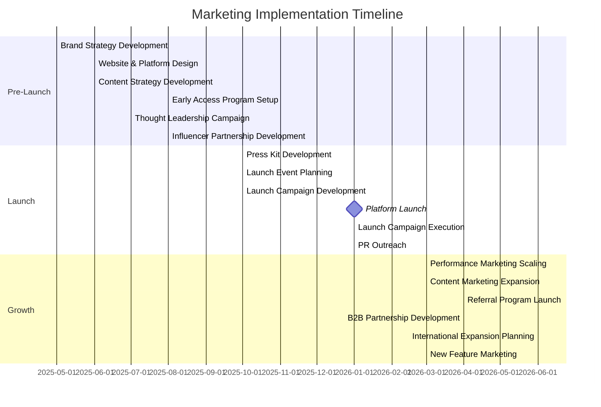

# FlipMyMiles AI Platform Marketing Strategy

## Executive Summary

This marketing strategy outlines the approach for positioning and promoting the AI-enhanced FlipMyMiles platform. The strategy focuses on highlighting the technological advantages, improved customer experience, and enhanced value proposition that AI brings to the miles and points brokerage ecosystem.

The target is to establish FlipMyMiles as the technology leader in the loyalty points marketplace, driving a 40% increase in transaction volume and 30% growth in customer base within 12 months of full implementation.

## Market Analysis

### Current Market Landscape

The miles and points brokerage industry operates in a gray area between loyalty program terms and consumer demand. Key market characteristics include:

- **Market Size**: Estimated $5-7 billion annually in traded miles/points
- **Growth Rate**: 15-20% annual growth pre-AI transformation
- **Key Players**: The Miles Market, The Points King, The Miles Broker
- **Customer Segments**:
  - Points Sellers (individuals with excess points)
  - Business Sellers (companies with accumulated rewards)
  - Premium Travel Buyers (seeking discounted luxury travel)
  - Mileage Brokers (B2B opportunities)

### Competitive Analysis

| Competitor | Strengths | Weaknesses | AI Integration |
|------------|-----------|------------|---------------|
| The Miles Market | Strong brand recognition, Large customer base | Manual processes, Slow transaction times | Minimal |
| The Points King | Competitive rates, Good customer service | Limited technology, Regional focus | Basic chatbot only |
| The Miles Broker | Wide program coverage, Established relationships | Outdated platform, Poor mobile experience | None |
| FlipMyMiles (Current) | Strong customer service, Competitive rates | Manual processes, Limited scalability | None |
| FlipMyMiles (Future) | AI-driven pricing, Automated matching, Enhanced security, Superior UX | Initial implementation costs, Change management | Comprehensive |

### SWOT Analysis

**Strengths**
- First-mover advantage in AI-powered miles brokerage
- Enhanced pricing accuracy through ML algorithms
- Faster transaction processing
- Improved security and fraud detection
- Data-driven market intelligence

**Weaknesses**
- Initial investment costs
- Learning curve for existing customers
- Potential technical challenges during implementation
- Dependency on quality data for AI models

**Opportunities**
- Capture market share from traditional brokers
- Expand into new loyalty program markets
- Develop B2B partnerships with travel agencies
- Create new revenue streams through API access
- Increase transaction volume through efficiency

**Threats**
- Competitor imitation
- Loyalty program policy changes
- Regulatory challenges
- Data privacy concerns
- Technical failures or security breaches

## Target Audience Segmentation

### 1. Individual Point Sellers

**Demographics**:
- Age: 30-65
- Income: $75,000+
- Frequent credit card users
- Travel 2-4 times per year

**Pain Points**:
- Low redemption value through traditional channels
- Uncertainty about point valuation
- Security concerns
- Complex selling process

**Value Proposition**:
- Higher payouts through AI-optimized pricing
- Streamlined, secure selling process
- Real-time valuation transparency
- Faster payment processing

### 2. Business Point Sellers

**Demographics**:
- Small to medium businesses
- Corporate travel departments
- Business credit card users
- Accumulated unused points

**Pain Points**:
- Inefficient utilization of rewards assets
- Complex management of multiple programs
- Lack of strategic approach to points

**Value Proposition**:
- Enterprise dashboard for portfolio management
- Higher valuation through AI optimization
- Streamlined bulk selling process
- Strategic recommendations for points accumulation

### 3. Premium Travel Buyers

**Demographics**:
- Age: 35-65
- Income: $150,000+
- Luxury travel preferences
- Value-conscious

**Pain Points**:
- High cost of premium travel
- Complexity of finding best deals
- Trust issues with traditional brokers
- Inconsistent availability

**Value Proposition**:
- AI-powered matching for optimal deals
- Transparent pricing and availability
- Enhanced security and verification
- Personalized travel recommendations

### 4. Travel Agencies (B2B)

**Demographics**:
- Small to large travel agencies
- Luxury travel specialists
- Corporate travel departments

**Pain Points**:
- Margin pressure on premium bookings
- Limited access to discounted inventory
- Manual booking processes

**Value Proposition**:
- API access to FlipMyMiles platform
- Increased margins on premium bookings
- Automated inventory access
- White-label solutions

## Brand Positioning

### Brand Promise

"Transform your unused miles into maximum value with AI-powered precision and security."

### Positioning Statement

For frequent travelers and businesses with accumulated miles and points, FlipMyMiles is the technology-driven loyalty currency marketplace that delivers superior value through AI-powered pricing, seamless transactions, and enhanced security, unlike traditional brokers who rely on manual processes and subjective valuations.

### Key Differentiators

1. **AI-Powered Pricing**: Data-driven valuation that maximizes returns for sellers and value for buyers
2. **Intelligent Matching**: Advanced algorithms that connect the right buyers and sellers
3. **Enhanced Security**: AI-based fraud detection and verification systems
4. **Streamlined Experience**: Intuitive interface with personalized recommendations
5. **Market Intelligence**: Data-driven insights for optimal timing and program selection

### Brand Voice

- **Authoritative**: Demonstrating expertise in the loyalty currency market
- **Transparent**: Clear communication about processes and pricing
- **Innovative**: Emphasizing technological leadership
- **Trustworthy**: Focusing on security and reliability
- **Customer-centric**: Highlighting value and convenience

## Marketing Objectives

1. **Awareness**: Increase brand awareness by 50% among target segments within 6 months
2. **Acquisition**: Grow customer base by 30% within 12 months of full launch
3. **Conversion**: Increase conversion rate from visitor to transaction by 25%
4. **Retention**: Improve customer retention rate to 85%
5. **Transaction Volume**: Increase total transaction volume by 40% within 12 months
6. **Market Share**: Achieve 30% market share within 24 months

## Marketing Strategy

### 1. Pre-Launch Phase (Months 1-9)

**Objectives**:
- Build anticipation for the AI platform
- Establish thought leadership in loyalty program technology
- Gather early adopter interest

**Tactics**:
- Teaser campaign highlighting upcoming transformation
- Thought leadership content on AI in loyalty programs
- Early access waitlist for existing customers
- Industry conference presentations
- Influencer partnerships with travel bloggers

### 2. Launch Phase (Months 10-12)

**Objectives**:
- Generate maximum visibility for platform launch
- Drive initial user adoption
- Showcase key differentiators

**Tactics**:
- Press release campaign
- Launch event (virtual and physical)
- Promotional offers for early adopters
- Influencer demonstrations and reviews
- Paid digital campaign across targeted channels
- Email marketing to existing customer base

### 3. Growth Phase (Months 13-24)

**Objectives**:
- Scale user acquisition
- Expand into new market segments
- Establish market leadership

**Tactics**:
- Targeted acquisition campaigns by segment
- Referral program implementation
- Strategic partnerships with travel platforms
- Content marketing focusing on success stories
- Continuous feature enhancement marketing
- B2B outreach program

## Channel Strategy

### Digital Marketing

1. **Search Engine Marketing**:
   - Targeted keywords related to miles, points, travel hacking
   - Competitor targeting
   - Geo-targeted campaigns for key markets

2. **Content Marketing**:
   - Blog series on maximizing points value
   - Educational content on loyalty program optimization
   - Case studies and success stories
   - Expert interviews and webinars

3. **Social Media**:
   - LinkedIn for B2B targeting
   - Instagram for aspirational travel content
   - Twitter for industry news and updates
   - Facebook for community building and targeted ads

4. **Email Marketing**:
   - Segmented campaigns based on user behavior
   - Personalized recommendations
   - Market intelligence reports
   - Loyalty program updates and opportunities

### Partnership Marketing

1. **Travel Influencers**:
   - Partnerships with points and miles bloggers
   - Sponsored content with travel influencers
   - Affiliate program for content creators

2. **Strategic Alliances**:
   - Integration with travel booking platforms
   - Partnerships with premium credit cards
   - Collaborations with luxury travel agencies

3. **B2B Partnerships**:
   - API access for travel agencies
   - White-label solutions for corporate travel departments
   - Referral programs for financial advisors

### Direct Marketing

1. **Customer Segmentation**:
   - Personalized outreach based on points portfolio
   - Targeted offers based on historical behavior
   - Loyalty program-specific campaigns

2. **Retention Marketing**:
   - Exclusive offers for repeat customers
   - Loyalty program with tiered benefits
   - Personalized market intelligence reports

## Content Marketing Strategy

### Content Pillars

1. **Educational Content**:
   - "The Ultimate Guide to Maximizing Points Value"
   - "Understanding Airline and Hotel Loyalty Programs"
   - "How AI is Transforming Travel Rewards"

2. **Case Studies**:
   - "How Business X Turned Unused Points into $50,000 in Value"
   - "From Economy to First Class: How John Used FlipMyMiles"
   - "How Travel Agency Y Increased Margins by 30%"

3. **Market Intelligence**:
   - Quarterly loyalty program valuation reports
   - Trend analysis and predictions
   - Program comparison guides

4. **Technology Insights**:
   - "Behind the Algorithm: How AI Maximizes Point Value"
   - "The Future of Loyalty Programs in a Digital World"
   - "Security in the Digital Points Marketplace"

### Content Distribution

1. **Owned Media**:
   - Company blog
   - Email newsletters
   - Mobile app content hub
   - Resource center

2. **Earned Media**:
   - PR outreach to travel publications
   - Guest posting on industry blogs
   - Podcast interviews
   - Speaking engagements

3. **Paid Media**:
   - Sponsored content on travel sites
   - Paid social promotion
   - Native advertising
   - Retargeting campaigns

## Marketing Technology Stack

1. **Customer Data Platform**:
   - Unified customer profiles
   - Behavioral tracking
   - Segmentation capabilities
   - Integration with AI platform

2. **Marketing Automation**:
   - Personalized email campaigns
   - Customer journey mapping
   - Trigger-based communications
   - Performance analytics

3. **Analytics & Reporting**:
   - Multi-touch attribution
   - Campaign performance dashboards
   - Conversion tracking
   - A/B testing platform

4. **Social Media Management**:
   - Content scheduling
   - Engagement monitoring
   - Performance analytics
   - Influencer management

5. **SEO & Content Tools**:
   - Keyword research
   - Content optimization
   - Performance tracking
   - Competitor analysis

## Budget Allocation

| Marketing Channel | Pre-Launch | Launch | Growth |
|-------------------|------------|--------|--------|
| Digital Advertising | 30% | 40% | 35% |
| Content Marketing | 25% | 15% | 20% |
| Influencer Partnerships | 15% | 20% | 15% |
| PR & Events | 20% | 15% | 10% |
| Technology & Analytics | 10% | 10% | 15% |
| Partnership Development | 0% | 0% | 5% |

**Total Budget**: $X million (to be determined based on company financials)

## Success Metrics & KPIs

### Awareness Metrics
- Brand search volume growth
- Social media following and engagement
- Press mentions and PR reach
- Website traffic growth

### Acquisition Metrics
- New user registrations
- Cost per acquisition (CPA)
- Conversion rate from visitor to registration
- Lead source performance

### Engagement Metrics
- Active users (daily, weekly, monthly)
- Session duration and frequency
- Feature adoption rates
- Mobile app downloads and usage

### Transaction Metrics
- Transaction volume (total and per user)
- Average transaction value
- Conversion rate from registration to transaction
- Repeat transaction rate

### Revenue Metrics
- Revenue growth
- Revenue per user
- Profit margin per transaction
- Customer lifetime value (CLV)

## Implementation Timeline

## Risk Management

| Risk | Mitigation Strategy |
|------|---------------------|
| Lower than expected adoption | Increase incentives, enhance onboarding, gather feedback |
| Competitor response | Accelerate feature development, emphasize differentiators |
| Technical issues during launch | Phased rollout, robust testing, dedicated support team |
| Regulatory challenges | Legal consultation, transparent communication, compliance focus |
| Negative press | Proactive PR strategy, rapid response plan, customer advocacy |

## Conclusion

This marketing strategy provides a comprehensive framework for successfully launching and growing the AI-enhanced FlipMyMiles platform. By emphasizing technological innovation, superior customer experience, and enhanced value proposition, FlipMyMiles is positioned to become the market leader in the loyalty points marketplace.

The strategy balances awareness building, customer acquisition, and retention efforts across multiple channels, with clear metrics for measuring success. Regular review and optimization of the strategy will ensure adaptability to market changes and continuous improvement of marketing effectiveness.

With proper execution of this strategy, FlipMyMiles will transform from a traditional miles broker to the technology leader in the loyalty currency marketplace, delivering superior value to customers while achieving significant business growth.
